## Neutrinos in the Standard Model

:::: {.columns}

::: {.column width="55%"}

- Three flavors: $\nu_e$, $\nu_\mu$, $\nu_\tau$
- Neutral spin-$1/2$ fermions
- Produced and detected through the weak interaction
- In the minimal renormalizable Standard Model, neutrinos are massless

::: {.takeaway}
Oscillations show that at least two neutrinos have nonzero mass.
:::

:::

::: {.column width="45%"}

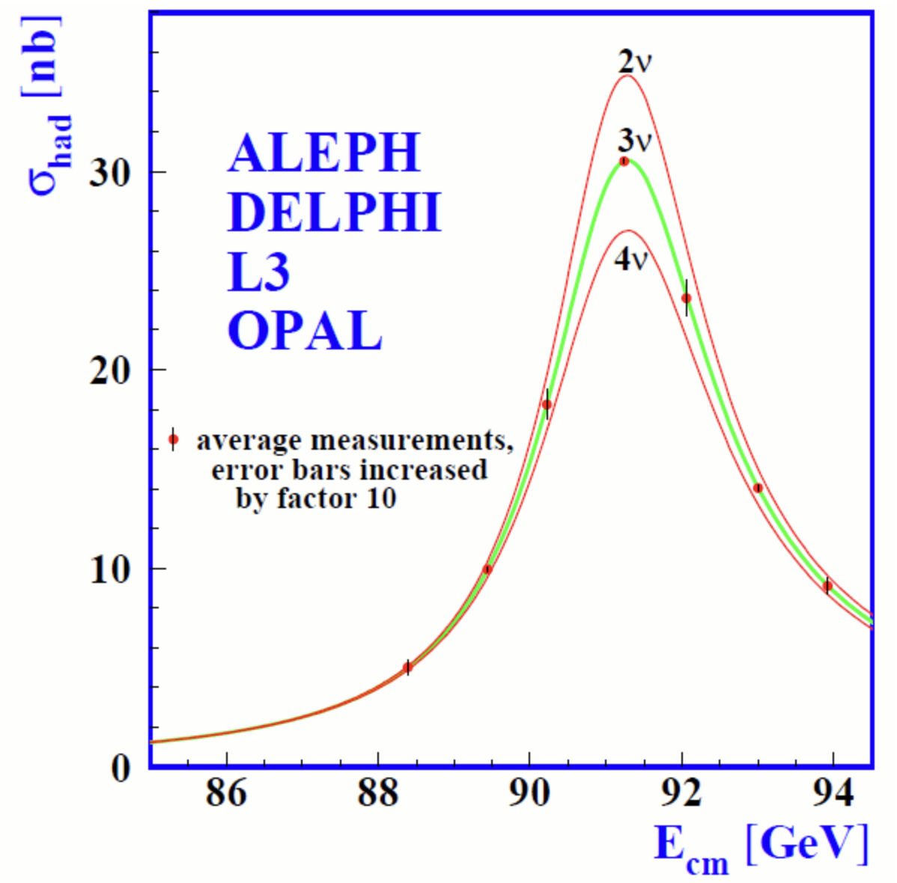{.slide-media .media-height-md}

::: {.media-caption}
The invisible width of the $Z$ is consistent with three light active neutrinos.
:::

:::

::::

## Why neutrinos are unusual messengers

The mean free path is

$$
\lambda_\nu = \frac{1}{n\sigma}.
$$

:::: {.columns}

::: {.column width="50%"}

**A 1 MeV solar neutrino**

$$
\sigma(\nu_e e)\sim10^{-44}\ \mathrm{cm^2},
\qquad
\lambda_\nu\sim10^{20}\ \mathrm{cm}
\sim10^9 R_\odot.
$$

The Sun is essentially transparent.

:::

::: {.column width="50%"}

**A 1 PeV neutrino crossing Earth**

$$
\sigma(\nu N)\sim10^{-33}\ \mathrm{cm^2},
\qquad
\lambda_\nu\sim3\times10^3\ \mathrm{km}.
$$

At extreme energies, even Earth becomes opaque.

:::

::::

::: {.takeaway}
Weak interaction makes neutrinos both difficult to detect and uniquely informative.
:::

## How much lead stops a neutrino?

```{=html}
<div id="nh-lead-wall" class="nh-interactive" data-poster="media/lead-wall-poster.png" aria-label="Neutrinos leave the Sun in three rays towards Alpha Centauri and cross lead bricks added one by one"></div>
```

## Flavor states and mass states

$$
\boxed{\displaystyle
|\nu_\alpha\rangle=\sum_i U_{\alpha i}^{*}|\nu_i\rangle
}
$$

:::: {.columns}

::: {.column width="50%"}

**Flavor states** $\nu_e,\nu_\mu,\nu_\tau$

Produced and detected in weak interactions.

:::

::: {.column width="50%"}

**Mass states** $\nu_1,\nu_2,\nu_3$

Propagate with definite masses and accumulate different phases.

:::

::::

::: {.takeaway}
The two bases do not coincide. This mismatch and distinct neutrino masses are the origin of oscillations.
:::

## Neutrino oscillations

:::: {.panel-tabset}

### Quantum chameleon



### Oscillation probability

<video class="slide-video media-height-md" style="--media-width: 980px; --media-max-height: 490px;" width="1280" height="720" muted loop controls preload="metadata" playsinline poster="media/oscillation_chameleon.jpg" src="media/oscillation_chameleon.mp4"></video>

::::

$$
P(\nu_e\!\to\!\nu_\mu)=
\sin^2 2\theta\,
\sin^2\!\left(\frac{\Delta m^2L}{4E}\right).
$$

::: {.media-caption}
Different propagation phases convert one detectable flavor mixture into another.
:::

## How do we know?

::: {.small}

| Neutrino source | Observed pattern | What it establishes |
|---|---|---|
| Solar | Energy-dependent $\nu_e$ survival | Flavor conversion in matter and vacuum |
| Atmospheric | Zenith- and energy-dependent $\nu_\mu$ disappearance | Oscillations over Earth-scale baselines |
| Reactors | Spectral disappearance of $\bar\nu_e$ | Precise mixing and mass splitting |
| Accelerators | Disappearance and appearance | Controlled tests across flavors |

:::

::: {.takeaway}
One three-neutrino framework describes independent sources, energies, and baselines.
:::

## The three-neutrino picture

:::: {.columns}

::: {.column width="52%"}

**Mixing**

$$
\theta_{12}\approx34^\circ,
\qquad
\theta_{13}\approx9^\circ,
\qquad
\theta_{23}\approx45^\circ.
$$

**Mass splittings**

$$
\Delta m^2_{21}\approx7.4\times10^{-5}\ \mathrm{eV^2},
$$

$$
|\Delta m^2_{31}|\approx2.5\times10^{-3}\ \mathrm{eV^2}.
$$

:::

::: {.column width="48%"}

The minimal oscillation picture contains

- three mixing angles;
- two independent mass-squared differences;
- one Dirac CP phase, $\delta_{\rm CP}$.

::: {.muted}
If neutrinos are Majorana particles, two additional phases do not affect oscillations.
:::

:::

::::

## Mass ordering

:::: {.columns}

::: {.column width="38%"}

**Normal ordering**

$$m_1<m_2<m_3$$

**Inverted ordering**

$$m_3<m_1<m_2$$

Solar data fix $m_2>m_1$. The sign of the atmospheric splitting distinguishes the two spectra.

:::

::: {.column width="62%"}

<video class="slide-video media-height-lg media-width-lg" style="--media-width: 96%;" width="1280" height="720" data-autoplay muted loop controls preload="metadata" playsinline poster="media/mass_ordering.jpg" src="media/NeutrinoHierarchyScales.mp4"></video>

:::

::::

## JUNO reads the interference pattern

:::: {.columns}

::: {.column width="61%"}

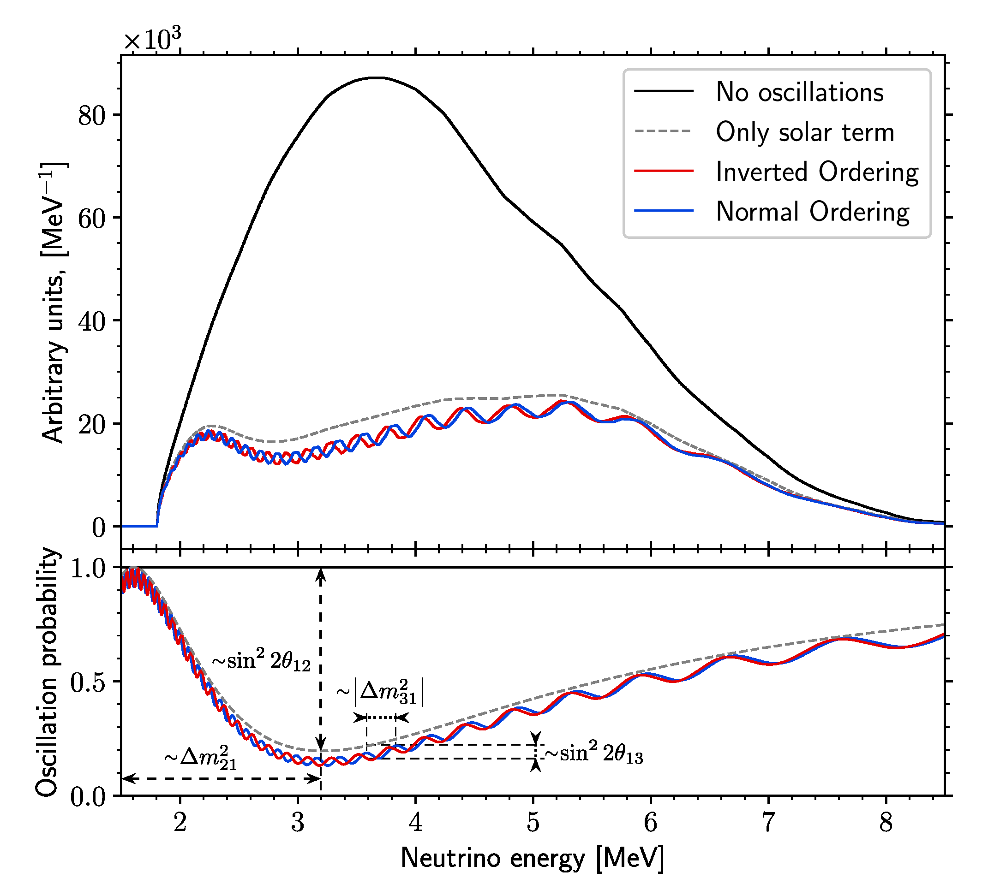{.slide-media .media-height-lg}


:::

::: {.column width="39%"}

- Reactor antineutrinos travel about 52.5 km to the detector.
- Fine spectral ripples carry information on the ordering in a vacuum-dominated measurement.
- A 20 kt liquid-scintillator target and precise energy response make the ripples measurable.
- TAO and Daya Bay constrain the unoscillated reactor spectrum.

:::

::::

## JUNO: larger data set, sharper parameters

::: {.small}

| JUNO analysis |  |
|---|---:|
| Live time | 207.2 days |
| IBD candidates | 8294 |
| $\sin^2\theta_{12}$ | $0.3036\pm0.0064$ |
| $\Delta m^2_{21}$ | $(7.388\pm0.078)\times10^{-5}\ \mathrm{eV^2}$ |
| $\Delta m^2_{31}$, NO | $+2.509^{+0.027}_{-0.025}\times10^{-3}\ \mathrm{eV^2}$ |

:::

- Combining JUNO and Daya Bay with long-baseline constraints gives $\chi^2_{\rm IO}-\chi^2_{\rm NO}=4.86$, corresponding to a **one-sided $2.1\sigma$ indication for normal ordering**.

## JUNO: one detector, a broad physics program

:::: {.panel-tabset}

### Detector
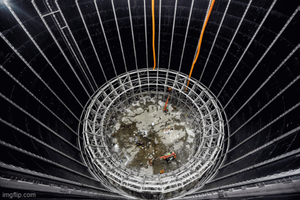{.slide-media style="--media-max-height: 250px;"}

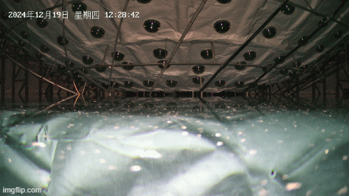{.slide-media style="--media-max-height: 250px;"}


### Inside Earth

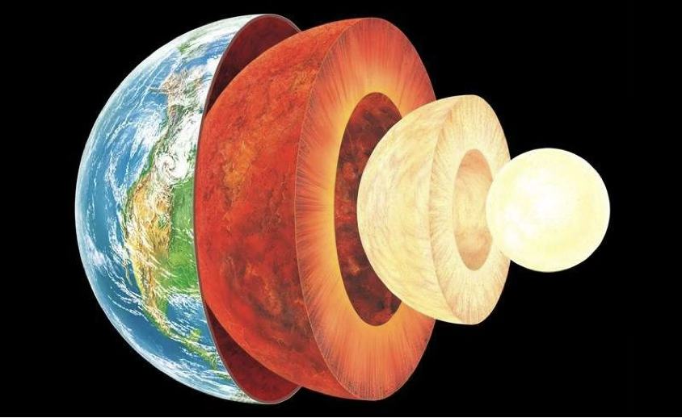{.slide-media fig-alt="Cutaway view of Earth's crust, mantle, outer core, and inner core" style="--media-max-height: 500px;"}


### The Sun

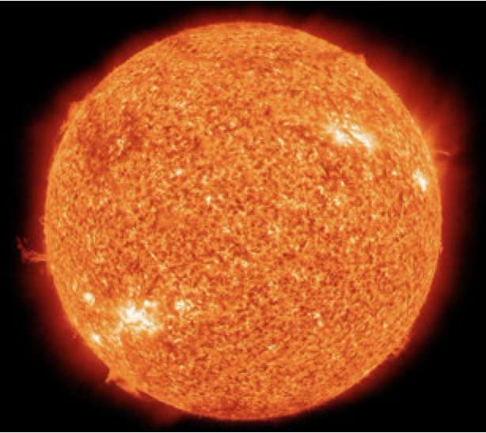{.slide-media fig-alt="The Sun seen as a bright orange disk" style="--media-max-height: 500px;"}


### Mass ordering

<video class="slide-video media-height-lg media-width-lg" style="--media-width: 96%;" width="1280" height="720" data-autoplay muted loop controls preload="metadata" playsinline poster="media/mass_ordering.jpg" src="media/NeutrinoHierarchyScales.mp4"></video>


### Atmosphere

<video class="slide-video media-height-md" style="--media-max-height: 500px;" width="1280" height="720" controls data-autoplay muted loop playsinline preload="metadata" poster="media/juno-atmospheric-poster.png" src="media/juno-atmospheric-shower.mp4"></video>


### Supernova

<video class="slide-video media-height-md" style="--media-max-height: 500px;" width="1920" height="1080" controls data-autoplay muted loop playsinline preload="metadata" poster="media/juno-supernova-poster.png" src="media/juno-supernova-illustration.mp4"></video>


### Proton decay

```{=html}
<div id="nh-juno-proton" class="nh-interactive" aria-label="Interactive cosmic clock and hypothetical proton-decay signature">
  <div class="nh-interactive-controls">
    <button type="button" data-juno-action="clock">Run cosmic clock</button>
    <button type="button" data-juno-action="candidate">Show hypothetical candidate</button>
    <button type="button" data-juno-action="reset">Reset</button>
  </div>
  <div class="nh-juno-decay-stage" data-juno-phase="ready">
    <div class="nh-juno-clock">
      <div class="nh-juno-clock-face" aria-hidden="true">
        <span class="nh-juno-hand nh-juno-hand-long" data-juno-hand="long"></span>
        <span class="nh-juno-hand nh-juno-hand-short" data-juno-hand="short"></span>
        <span class="nh-juno-pivot"></span>
      </div>
      <output data-juno-age>0.0 billion years</output>
      <span class="nh-juno-stage-label">One sweep compresses the age of the Universe</span>
    </div>
    <div class="nh-juno-event">
      <div class="nh-juno-proton" aria-hidden="true">\(p\)</div>
      <div class="nh-juno-event-label">No proton decay has been observed</div>
      <div class="nh-juno-pulses" aria-label="Hypothetical three-pulse signal: kaon, muon, Michel positron">
        <span>\(K^+\)</span><span>\(\mu^+\)</span><span>\(e^+\)</span>
      </div>
    </div>
  </div>
  <p class="nh-juno-decay-status" data-juno-status aria-live="polite">Run the cosmic clock: the proton remains. The candidate button then illustrates a possible signal.</p>
  <p class="nh-widget-source">Illustration only: the clock is compressed and the candidate is triggered deliberately, not predicted at the Universe's age. JUNO searches for \(p\to\bar\nu K^+\); the kaon, its decay daughter, and a later Michel positron can produce three time-correlated light pulses. </p>
</div>
```

::::

## What is the neutrino mass?

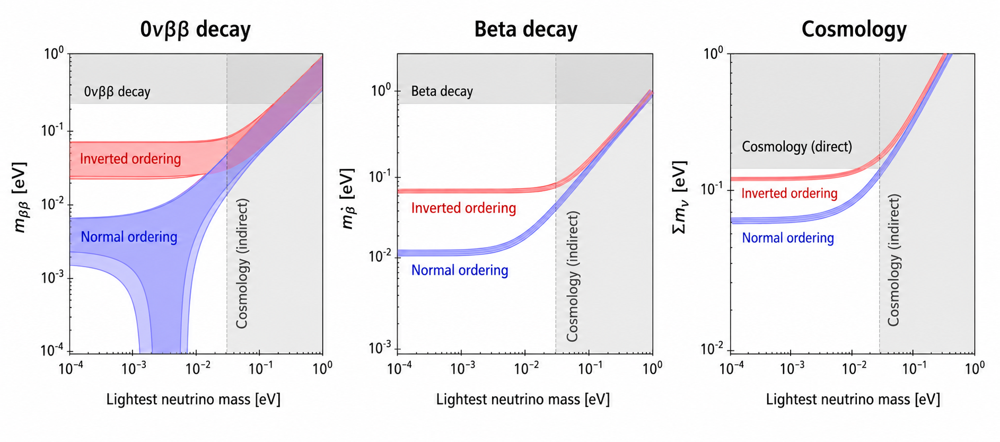{.slide-media .media-height-md .media-width-lg}

::: {.small}

| Observable | Sensitive to |
|---|---|
| Oscillations | Differences $\Delta m^2_{ij}$ |
| Beta-decay kinematics | $m_\beta^2=\sum_i|U_{ei}|^2m_i^2$ |
| Cosmology | The mass sum $\sum_i m_i$ |

:::

::: {.takeaway}
Oscillations set the spacing of the spectrum, not its absolute position.
:::

## KATRIN: electron motion through the MAC-E filter

<video class="slide-video media-height-lg" width="1280" height="720" controls data-autoplay muted loop playsinline preload="metadata" poster="media/katrin-electron-motion.jpg" src="media/katrin-electron-motion.mp4"></video>

## KATRIN: the endpoint becomes a count rate

```{=html}
<div id="nh-katrin-spectrum" class="nh-interactive" aria-label="Interactive tritium beta spectrum and MAC-E transmission">
  <div class="nh-interactive-controls">
    <label>Retarding window \(\Delta=E_0-e|U|\) <input type="range" data-control="window" min="1" max="12" value="5" step="1"><output data-value="window">\(5\,\mathrm{eV}\)</output></label>
    <label>Illustrative \(m_\beta\) <input type="range" data-control="mass" min="0" max="2" value="0.5" step="0.1"><output data-value="mass">\(0.5\,\mathrm{eV}\)</output></label>
  </div>
  <canvas width="1120" height="440" role="img" aria-label="Spectrum near the tritium endpoint, transmitted fraction, and retarding threshold"></canvas>
  <p data-summary></p>
</div>
```

## Dirac or Majorana?

::: {.small}

| Dirac neutrino | Majorana neutrino |
|---|---|
| Particle and antiparticle are distinct | Particle and antiparticle are identical |
| Lepton number can remain conserved | Lepton-number violation becomes possible |

:::

The experimental path is neutrinoless double beta decay:

$$
\boxed{(A,Z)\rightarrow(A,Z+2)+2e^-}
$$

No neutrinos appear in the final state. Observation would establish lepton-number violation and the Majorana nature of neutrinos.

## CP violation

$$
\boxed{
P(\nu_\alpha\to\nu_\beta)
\neq
P(\bar\nu_\alpha\to\bar\nu_\beta)
}
$$

- The phase $\delta_{\rm CP}$ controls CP-odd effects in three-flavor oscillations.

- Long-baseline experiments compare neutrino and antineutrino appearance while controlling matter effects.


::: {.takeaway}
The central question is whether lepton mixing violates CP, and by how much.
:::

## DUNE: a 1300 km matter baseline

:::: {.columns}

::: {.column width="54%"}

- A beam from Fermilab reaches the far detector in South Dakota.
- The long baseline strengthens the matter effect, helping separate ordering from CP effects.
- Near and far measurements constrain the beam and interaction model.
- Appearance channels compare $\nu_\mu\to\nu_e$ with $\bar{\nu}_\mu\to\bar{\nu}_e$.

:::

::: {.column width="46%"}

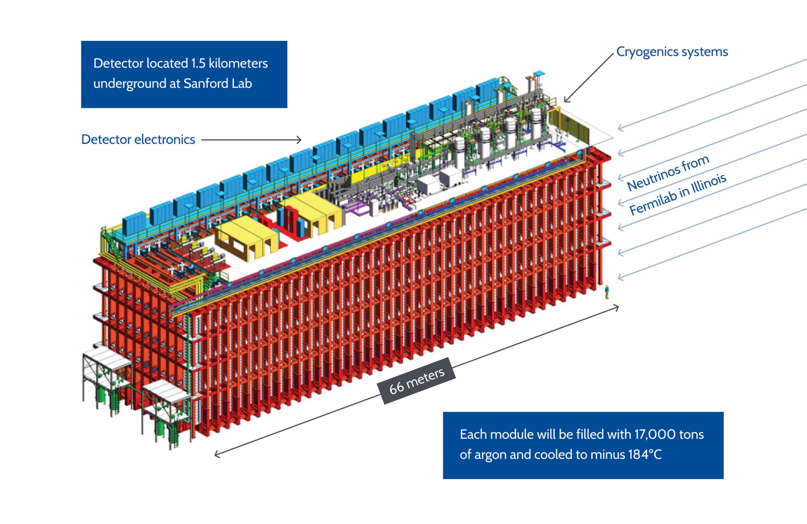{.slide-media .media-height-lg}


:::

::::

## Neutrinos as probes

::: {.small}

| Source | Typical energy | Hidden information carried by neutrinos |
|---|---:|---|
| Nucleon target | GeV | Quark-flavor content and parton distributions |
| Sun | MeV | Nuclear burning in the solar core |
| Earth | MeV | Radioactive heat from the crust and mantle |
| Core-collapse supernova | MeV | Collapse, bounce, accretion, and cooling |
| Cosmic accelerators | TeV–PeV | Hadronic processes in extreme environments |

:::

::: {.takeaway}
Neutrinos escape dense regions that are opaque to light and point back to their origin.
:::

## Looking inside the Sun

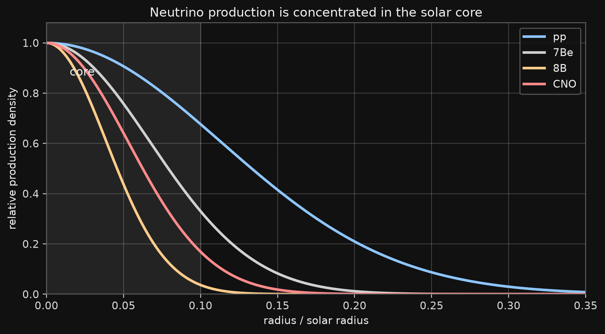{.slide-media .media-height-lg .media-width-lg}

:::: {.columns .small}

::: {.column width="50%"}

Solar neutrinos provide a direct, real-time view of nuclear reactions in the core.

:::

::: {.column width="50%"}

Different components probe different reactions, temperatures, and production radii.

:::

::::

## Looking inside the Earth

:::: {.columns}

::: {.column width="43%"}

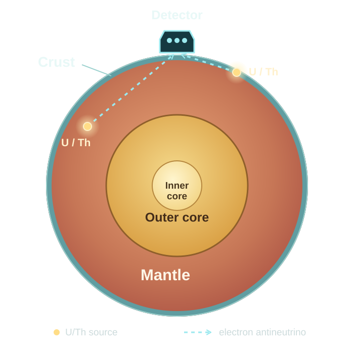{.slide-media .media-height-lg}

::: {.media-caption}
Crust enlarged; paths illustrative. [Layers: USGS](https://www.usgs.gov/programs/earthquake-hazards/science-earthquakes) · [U/Th sources: Borexino](https://borex.lngs.infn.it/papers/related-articles/mantle-geoneutrinos-in-kamland-and-borexino/).
:::

:::

::: {.column width="57%"}

Electron antineutrinos from the $^{238}$U and $^{232}$Th decay chains reveal:

- the radiogenic contribution to Earth's heat;
- the distribution of heat-producing elements;
- the difficult separation of crust and mantle signals.

::: {.takeaway}
Geoneutrinos connect particle detection to the planet's thermal history.
:::

:::

::::

## Supernova neutrinos

:::: {.columns}

::: {.column width="56%"}

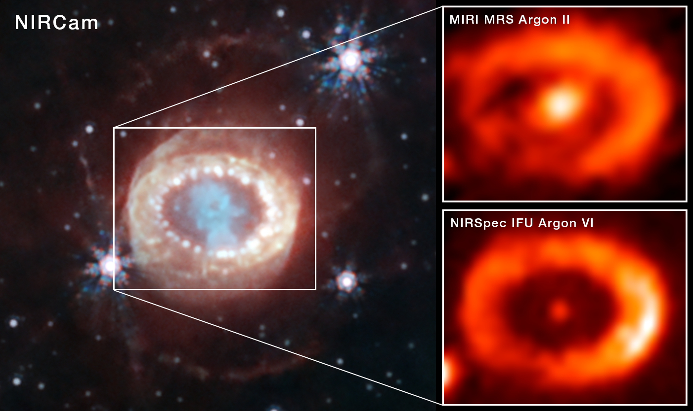{.slide-media .media-height-lg}

::: {.media-caption}
[SN 1987A: NASA, ESA, CSA, STScI, and collaborators](https://science.nasa.gov/asset/webb/sn-1987a-nircam-miri-and-nirspec-images/)
:::

:::

::: {.column width="44%"}

The roughly two dozen neutrinos detected from SN 1987A opened neutrino astronomy beyond the Sun.

A future Galactic event could resolve:

- collapse and core bounce;
- accretion dynamics;
- proto-neutron-star cooling;
- flavor transformation in extreme matter.

:::

::::

## High-energy neutrino astronomy

:::: {.columns}

::: {.column width="62%"}

<video class="slide-video media-height-lg" width="1280" height="720" data-autoplay muted loop controls preload="metadata" playsinline poster="media/posterImage-1771.png" src="media/baikal_short-1770.mp4"></video>

:::

::: {.column width="38%"}

- Neutral messengers point back to their sources.
- Hadronic interactions produce neutrinos together with photons and cosmic rays.
- IceCube, Baikal-GVD, and KM3NeT open complementary views of the sky.

::: {.takeaway}
The signal is faint, but it is unusually clean evidence of particle acceleration.
:::

:::

::::

## Baikal-GVD

:::: {.columns}

::: {.column width="58%"}

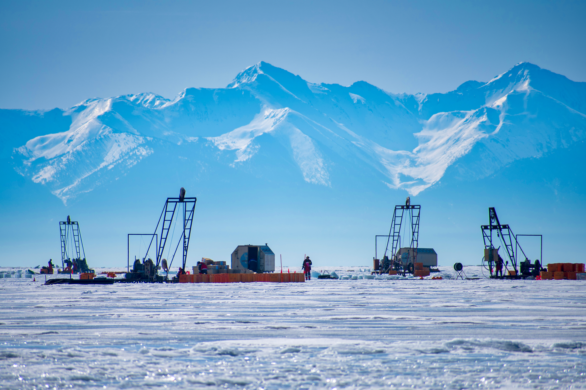{.slide-media .media-height-lg}

::: {.media-caption}
Deployment on Lake Baikal. Photo: B. Shaybonov.
:::

:::

::: {.column width="42%"}

A cubic-kilometer-scale telescope uses deep, clear lake water as both target and Cherenkov medium.

The program addresses:

- the diffuse astrophysical flux;
- searches for point-like sources;
- the Galactic plane;
- multimessenger coincidences.

:::

::::

## Summary

- Fundamentals
  - Neutrino mass and mixing

- Frontiers

  - Ordering, absolute mass, Majorana nature, and CP violation

- Probes

  - The Sun, Earth, supernovae, and the high-energy Universe

## Want to go deeper?

:::: {.columns}

::: {.column width="60%"}

We teach this field from the ground up: a two-year online program, **Neutrino Physics and Particle Astrophysics** («Физика нейтрино и астрофизика частиц»).

- More than 30 courses in four modules
- A theory track or an experiment track, with research projects
- Stipends for students who continue into the second module, from March 2027
- Courses are taught in Russian

:::

::: {.column width="40%"}

{.slide-media .media-height-lg fig-alt="QR code for teach-in.ru/program"}

::: {style="text-align: center;"}
[teach-in.ru/program](https://teach-in.ru/program)
:::

:::

::::

::: {.takeaway}
Join us.
:::
