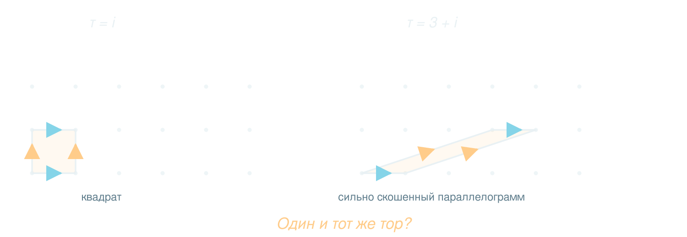
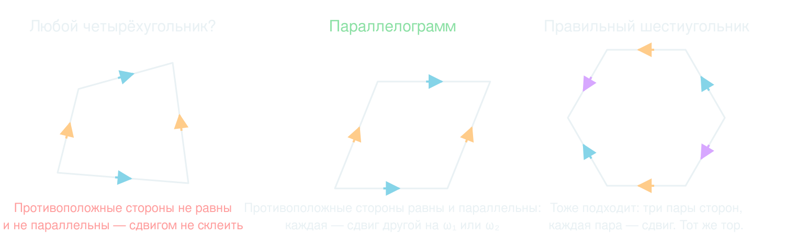
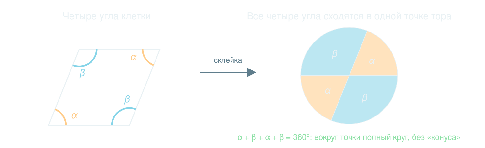
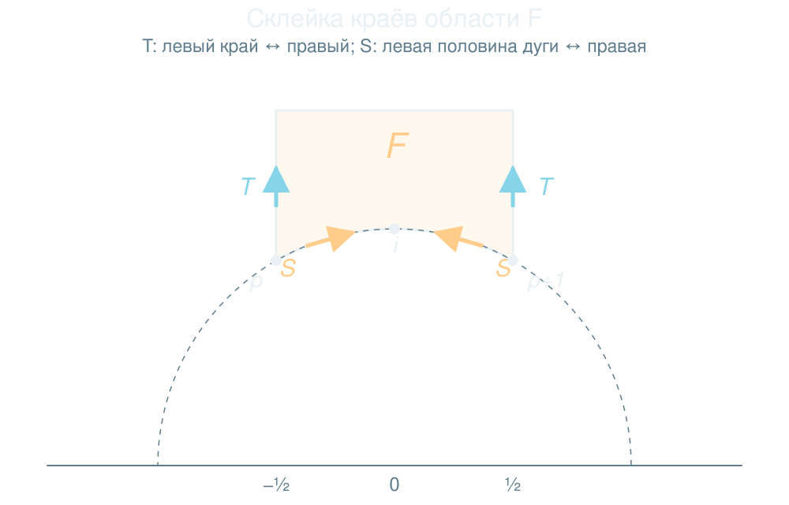
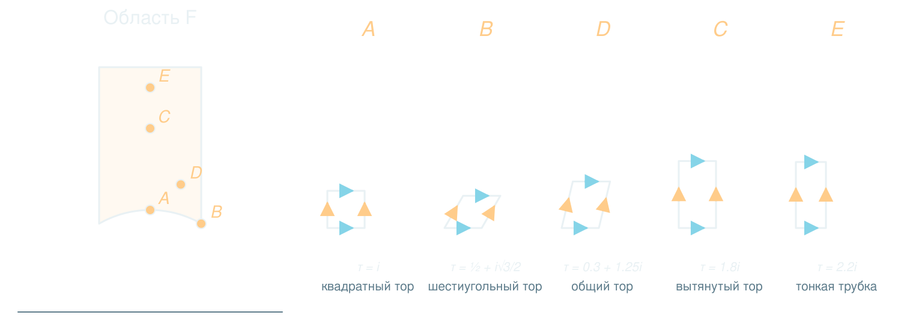

<!--
  Лекция «Один бублик — бесконечно много имён». Русский, 50–55 минут.
  Уровень входа: комплексные числа, поворот и растяжение, матрицы 2×2. Физики нет.
  Договорённости (держать до конца):
    ω₁ = 1 — голубой («цикл a»), ω₂ = τ — янтарный («цикл b»).
    Решётка Λ = { mω₁ + nω₂ }.  Новые периоды: ω₂′ = aω₂ + bω₁,  ω₁′ = cω₂ + dω₁.
    Закадровый текст — в заметках докладчика (клавиша S).  «Действие:» — что делать с виджетом.
  Приём 3b1b: сначала вопрос и картинка, потом слова. Пауза-вопросы помечены «Пауза».
-->

## Один бублик — бесконечно много имён

::: {.chapter-tag}
Модулярная симметрия с нуля
:::

Когда два бублика — это один и тот же бублик?

::: {.muted .small}
Нужны только комплексные числа, поворот и немного терпения.
:::

::: {.notes}
**Голос.** Сегодня мы разберём вещь, которая звучит страшно: «модулярная симметрия». Слово «модулярная» отпугивает, слово «симметрия» обманывает. На самом деле это ответ на детский вопрос: когда два бублика считать одним и тем же? К концу лекции у нас будет группа, плитка на плоскости и честное понимание, откуда берётся матрица два на два с целыми числами. По дороге мы разберём вообще все симметрии, которые тут живут, и аккуратно разложим их по полочкам. Предварительно знать нужно только комплексные числа: что умножение на комплексное число — это поворот с растяжением.

**План (≈ 52 мин).** 0 — крючок (3). 1 — параллелограмм и тор (7). 2 — форма и число τ (5). 3 — зоопарк симметрий (8). 4 — одна решётка, много клеток (8). 5 — движения T и S (6). 6 — алгоритм приведения (7). 7 — фундаментальная область (5). 8 — гиперболическая геометрия (3). 9 — что такое модулярная симметрия (3). 10 — итоги и задачи (2).
:::

## Игра, в которой нет края

```{=html}
<div data-ms="world" class="nh-interactive" aria-label="Периодический мир: точку можно тянуть, копии клетки показывают тор"></div>
```

::: {.takeaway}
Тяните точку: выйдя за правый край, вы возвращаетесь слева.
:::

::: {.notes}
**Голос.** Помните старые игры, где персонаж выходит за правый край экрана и появляется слева? Вышел сверху — появился снизу. Экран такой игры — это тор. Чтобы это увидеть, нарисуем вокруг нашего экрана его копии, как плитку на полу. Буква F в каждой копии — одна и та же буква, а точка — одна и та же точка. Когда вы тянете точку за край, на самом деле ничего не телепортируется: в соседней клетке просто уже стоит её копия.

**Действие.** Потянуть точку через правый край, через верхний. При протягивании остаётся след: прямая линия через плоскость, которая в каждой клетке разбивается на одни и те же куски. Подвигать слайдеры Re τ и Im τ: клетка не обязана быть квадратом, но тор остаётся тором. Кнопка «Квадрат» — вернуться к игре.

**Что запомнить зрителям.** Буква F не отражается — все копии получаются сдвигом. Это важно: склейка сдвигами.
:::

## Загадка

{.nh-ms-fig fig-alt="Две клетки: квадрат (τ = i) и сильно скошенный параллелограмм (τ = 3 + i) на одной и той же сетке точек"}

::: {.question}
Если склеить эти две клетки, получатся разные торы или один и тот же?
:::

::: {.notes}
**Голос.** Вот загадка на всю лекцию. Слева квадрат. Справа — очень скошенный параллелограмм со сторонами 1 и 3 + i. Склеим противоположные стороны каждой клетки. Получатся разные торы или один?

**Пауза.** Дать 10–15 секунд подумать. Подсказка для внимательных: посмотрите на точки на заднем плане. Вершины клеток стоят в одних и тех же точках сетки — картинки с точками совпадают, меняется только то, как мы эти точки соединили в клетку. Ответ вернёмся смотреть в главе 4.

**Если спросят «и что?»** Загадка про переименование: одна и та же решётка точек допускает много разных клеток. Из этого вырастет вся модулярная симметрия.
:::

## Что мы выясним

::: {.incremental}
1. Как плоский параллелограмм превращается в тор — и почему именно параллелограмм?
2. Что такое «форма» тора? Окажется, что это одно комплексное число $\tau$.
3. Какие параллелограммы дают один и тот же тор?
4. Что такое модулярная симметрия — и откуда у неё группа матриц $SL(2,\mathbb Z)$?
:::

::: {.notes}
**Голос.** Четыре вопроса. Первый — геометрический: как параллелограмм становится тором. Второй — как описать форму тора одним числом. Третий — самый интересный: когда два параллелограмма дают один тор. И четвёртый: что это за симметрия и что за группа. Мы будем идти от картинок к формулам, а не наоборот. Каждый раз сначала смотрим, потом называем.

**Заметка.** Если аудитория старше — в этом месте можно сказать, что слово «модулярная» здесь от «модуль» в смысле «параметр формы тора» (moduli), а не от «остатка по модулю». Хотя, как мы увидим в конце, остатки тоже появятся.
:::

<!-- ================= ГЛАВА 1 ================= -->

## Склеиваем: клетка → цилиндр → тор

::: {.chapter-tag}
Глава 1 · От параллелограмма к тору
:::

```{=html}
<div id="nh-torus3d" class="nh-interactive" data-poster="media/posters/torus3d-poster.png" aria-label="Параллелограмм сворачивается в цилиндр и склеивается в тор"></div>
```

::: {.notes}
**Голос.** Берём параллелограмм со сторонами 1 и τ. Склеиваем левую и правую стороны: они отличаются сдвигом на 1. Получается цилиндр, и голубая сторона превращается в окружность вокруг трубки. Теперь два торца цилиндра отличаются сдвигом на τ. Загибаем и склеиваем — получился бублик, а янтарная сторона стала петлёй вокруг кольца.

**Действие.** Ползунок «Склейка» — медленно. Кнопки «Клетка», «Цилиндр», «Тор». Потом менять Re τ, Im τ: клетка перекашивается, тор меняет форму. Кнопка «Квадратный тор».

**Честность.** Бублик в 3D — картинка; когда клетка прямоугольная (Re τ = 0), эта картинка сохраняет углы. Когда клетка скошена, на бублике появляется искажение. Мы вернёмся к этому через два слайда. Виджет — тот же, что в лекции georgia-2026, только по-русски.
:::

## Что такое «склеить»

Точки плоскости считаем **одной точкой**, если они отличаются на целое число периодов:

$$
z\;\sim\; z+m\cdot 1+n\cdot\tau,\qquad m,n\in\mathbb Z .
$$

::: {.fragment}
Тор — это плоскость, в которой отождествили все такие точки: $\;T_\tau=\mathbb C\,/\,(\mathbb Z+\mathbb Z\tau)$.
:::

::: {.fragment}
Точка клетки ⟷ точка тора: **ровно одна** (кроме границы клетки).
:::

::: {.notes}
**Голос.** Запишем то, что мы только что видели, формулой. Две точки плоскости — это одна точка тора, если разность между ними равна целому числу единиц плюс целому числу τ. Все такие сдвиги вместе образуют решётку. Тор — это плоскость, поделённая на эту решётку. Обозначение «C делить на Z плюс Z τ» читаем буквально: «плоскость, где точки, отличающиеся на элемент решётки, склеены».

Слово «решётка» мы будем использовать всю лекцию. Решётка — это все точки вида m + nτ: и сами «концы» клеток, и вообще все целочисленные комбинации двух векторов.

**Важно.** Из каждого класса точек ровно один представитель лежит в одной клетке. Поэтому клетка — это «карта» тора, а склеенные стороны — места, где карта заходит сама на себя.
:::

## Почему именно параллелограмм?

{.nh-ms-fig fig-alt="Произвольный четырёхугольник не склеить сдвигами; параллелограмм и шестиугольник можно"}

::: {.notes}
**Голос.** Почему мы клеим параллелограммы, а не любые четырёхугольники? Потому что у нас особая склейка — сдвигом. Сторона должна совпасть с противоположной после параллельного переноса. А значит, обе стороны равны по длине и параллельны. Четырёхугольник, у которого противоположные стороны равны и параллельны, — это и есть параллелограмм. Слева попытка склеить кривой четырёхугольник: стороны разной длины и наклона — сдвигом одно в другое не перевести.

А вот шестиугольник справа тоже подходит, если он центрально-симметричный: три пары противоположных сторон, и каждая пара — сдвиг. Тор получится тот же самый. Мы будем работать с параллелограммами, потому что их проще нарисовать: две стороны — два вектора.

**Побочная ремарка.** Если одну пару сторон склеить со сдвигом и разворотом (с зеркалом) — получится бутылка Клейна. Мы такого не делаем. Нас интересуют только сдвиги, то есть склейки, которые сохраняют ориентацию.
:::

## Куда делись углы?

{.nh-ms-fig fig-alt="Четыре угла параллелограмма сходятся в одной точке тора и составляют полный круг"}

::: {.notes}
**Голос.** Тонкость. Все четыре вершины клетки — это одна точка тора. Что вокруг неё? Углы параллелограмма попарно равны: α, β, α, β, и α + β равно 180 градусам. Сложим все четыре — выйдет ровно 360. То есть вокруг этой точки полный круг, как вокруг любой другой точки плоскости. Никакого «острия» или «конуса» там нет.

Вывод: тор плоский. Это не метафора: в каждой точке, включая вершины, геометрия — обычная евклидова плоскость. Кривизна нулевая.

**Мостик.** Если бы углы не складывались в 360, получилась бы коническая точка, как на кончике пакета. Дальше в лекции такие «конические» точки всё же появятся — но уже не на торе, а в пространстве всех торов (глава 7).
:::

## Бублик — это только картинка

:::: {.columns}

::: {.column width="55%"}
**Плоский тор** — это экран из игры: геометрия обычная, кривизна нулевая, расстояния как на плоскости.

**Бублик в трёхмерном пространстве** — одна из картинок тора. У него есть кривизна: снаружи положительная, внутри отрицательная.

::: {.fragment}
Бублик из круглой трубки сохраняет углы плоской клетки, **если клетка прямоугольная** ($\operatorname{Re}\tau=0$). Если клетка скошена, картинка искажает.
:::
:::

::: {.column width="45%"}
::: {.nh-ms-cyan}
Настоящий плоский тор нельзя гладко вложить в трёхмерное пространство.
:::

::: {.muted .small}
Любая гладкая замкнутая поверхность в $\mathbb R^3$ имеет точки с положительной кривизной. Поэтому «вложение с сохранением расстояний» невозможно, и бублик растягивает клетку.
:::
:::

::::

::: {.takeaway}
Тор — это не форма в пространстве, а правило склейки. Форму задаёт решётка.
:::

::: {.notes}
**Голос.** Предупреждение, чтобы вы не запутались позже. Бублик, который мы рисуем в трёхмерном пространстве — всего лишь одна из картинок тора. У него есть кривизна: снаружи он выпуклый, внутри — седловой. А «настоящий» тор из игры — плоский. Можно доказать, что гладко и без растяжения вложить плоский тор в трёхмерное пространство нельзя. Поэтому бублик растягивает одни места и сжимает другие. Для прямоугольной клетки есть красивый факт: круглый бублик с подходящим отношением радиусов сохраняет углы клетки. Для скошенной клетки такого бублика нет — в нашем виджете это видно по искажению круглой метки.

**Экзотика, для любопытных.** Теорема Нэша — Кёйпера говорит, что негладкое (только C¹) вложение с сохранением расстояний существует: оно выглядит как мелкая гофрировка. Для лекции это не нужно.

**Вывод.** Нам важно не как тор выглядит, а какая у него решётка периодов.
:::

<!-- ================= ГЛАВА 2 ================= -->

## Сколько чисел задают тор?

::: {.chapter-tag}
Глава 2 · Форма тора — одно число
:::

```{=html}
<div data-ms="lattice" class="nh-interactive" data-poster="media/posters/lattice.png" aria-label="Два вектора-периода: можно тянуть концы, поворачивать и растягивать оба сразу"></div>
```

::: {.notes}
**Голос.** Параллелограмм задаётся двумя векторами, а вектор на плоскости — комплексное число. Значит, две комплексные константы ω₁ и ω₂. Это четыре вещественных числа. А сколько из них — «форма», а сколько — просто размер и положение в плоскости?

**Действие.** Сначала потянуть концы векторов: τ — точка справа — движется. Потом отпустить и подвигать «поворот» и «растяжение»: оба вектора вертятся и растут вместе, решётка вертится и растёт, а точка τ стоит на месте. Вывод: два вещественных числа из четырёх — это «поворот и масштаб», они на форму не влияют. Остаётся два числа, то есть одно комплексное.

**Пауза.** Спросить: «Как из двух комплексных чисел сделать одно, которое не меняется при общем повороте и растяжении?»
:::

## Поворот и растяжение — это умножение

Умножить все точки плоскости на $\lambda=re^{i\varphi}$ — значит повернуть на угол $\varphi$ и растянуть в $r$ раз.

::: {.fragment}
Периоды при этом: $\;\omega_1\to\lambda\omega_1,\;\;\omega_2\to\lambda\omega_2$. Форма клетки не меняется.
:::

::: {.fragment}
$$
\frac{\lambda\omega_2}{\lambda\omega_1}=\frac{\omega_2}{\omega_1}\;\equiv\;\tau .
$$
:::

::: {.fragment .takeaway}
Форма клетки — это отношение периодов $\tau=\omega_2/\omega_1$.
:::

::: {.notes}
**Голос.** Вспомним школьную геометрию комплексных чисел. Умножение на число r·e^{iφ} — это поворот на φ и растяжение в r раз. Подобные фигуры, то есть фигуры той же формы, получаются одна из другой умножением на комплексное число. Значит, при умножении на λ оба периода умножаются на λ — а вот отношение периодов не меняется: λ сокращается. Отношение — это и есть то самое комплексное число, которое помнит только форму.

Теперь мы можем всегда выбирать масштаб и поворот так, чтобы ω₁ = 1. Тогда ω₂ = τ, а клетка — это параллелограмм со сторонами 1 и τ. Именно такой мы рисовали в начале.

**Для уверенности.** Модуль |τ| — отношение длин сторон, аргумент arg τ — угол между ними. Два числа — вся форма.
:::

## Все формы живут в верхней полуплоскости

Периоды можно пронумеровать так, чтобы $\operatorname{Im}\tau>0$. Тогда **форма клетки = точка $\tau$ верхней полуплоскости $\mathbb H$**.

| $\tau$ | какая клетка |
|:--|:--|
| $i$ | квадрат |
| $2i$ | прямоугольник $1\times2$ |
| $e^{i\pi/3}=\tfrac12+\tfrac{\sqrt3}{2}i$ | ромб с углом $60^\circ$ (две правильные «половинки») |
| $e^{2\pi i/3}=-\tfrac12+\tfrac{\sqrt3}{2}i$ | ромб с углом $120^\circ$ (та же решётка!) |
| $3+i$ | сильно скошенный параллелограмм |

::: {.notes}
**Голос.** Если Im τ получилась отрицательной — поменяем периоды местами, и станет положительной. Поэтому все формы лежат в верхней полуплоскости. Это наша карта: каждая точка плоскости — одна форма клетки. Запомним четыре точки. i — квадрат. 2i — прямоугольник. Точка e^{iπ/3} — ромб с углом 60 градусов: две правильные треугольные «половинки». А e^{2πi/3} — ромб с углом 120 — но решётка у него та же самая, что у 60-градусного! Это уже намёк, что на карте точки не обязательно различают торы.

И последняя — τ = 3 + i, наш скошенный параллелограмм из загадки. На карте это точка далеко от i. Если считать, что одна точка карты — один тор, то эти два тора разные. Но мы подозреваем, что это не так.

**Проверка зала.** «Где на карте клетка, у которой одна сторона вдвое длиннее другой и они перпендикулярны?» (τ = 2i, или τ = i/2 — две разные точки!).
:::

## Но карта врёт?

:::: {.columns}

::: {.column width="55%"}
Каждой точке $\mathbb H$ отвечает тор.

::: {.fragment}
Но мы уже подозреваем, что у $\tau=i$ и $\tau=3+i$ **одна и та же** решётка точек.
:::

::: {.fragment}
Тогда на карте **один тор встречается много раз**, и надо понять, сколько и в каких точках.
:::
:::

::: {.column width="45%"}
::: {.question}
Сколько раз каждый тор нарисован на карте $\mathbb H$?
:::
:::

::::

::: {.takeaway}
Вся дальнейшая лекция — про то, как устроены эти повторы.
:::

::: {.notes}
**Голос.** Итог главы. Каждая точка верхней полуплоскости — это форма клетки, то есть тор. Но если у двух разных τ получаются одинаковые решётки, то один тор на карте нарисован много раз. Мы хотим узнать, как именно: сколько раз, в каких точках и по какому закону. Это ответ на вопрос «какие параллелограммы дают один и тот же тор». Дальше — две главы подготовки: сначала расставим по полочкам все симметрии, а потом найдём закон повторов.
:::

<!-- ================= ГЛАВА 3 ================= -->

## Что значит «одинаковые»?

::: {.chapter-tag}
Глава 3 · Зоопарк симметрий
:::

Слово «одинаковые» для двух торов можно понимать трояко:

| Считаем торы одинаковыми, если… | Что остаётся | Сколько вещественных параметров |
|:--|:--|:-:|
| один можно **непрерывно деформировать** в другой | ничего: все торы — «бублик» | 0 |
| один можно **жёстко наложить** на другой (сдвиг, поворот) | форма **и размер** | 3 |
| один можно наложить с **поворотом и растяжением** | только **форма** | 2 |

::: {.fragment .takeaway}
Нас интересует третий вариант: форма без размера. Её задаёт $\tau$.
:::

::: {.notes}
**Голос.** Прежде чем перечислять симметрии, договоримся, что именно мы считаем «тем же самым». Есть три разумных ответа.

Первый, топологический: бублик можно мять как глину, пока не рвём. Тогда все торы одинаковы, и говорить не о чем.

Второй, жёсткий: тор можно положить на другой сдвигом и поворотом. Тогда важна и форма, и размер: три вещественных числа — две длины периодов и угол между ними.

Третий: можно ещё и растягивать, сохраняя углы, то есть умножать на комплексное число. Тогда остаётся только форма — два вещественных числа, одно комплексное τ. Это и есть наш выбор. Он ровно посередине: достаточно грубый, чтобы размер не мешал, и достаточно тонкий, чтобы различать квадратный тор и шестиугольный.

**Уточнение для дотошных.** Три параметра во второй строке — для решётки с зафиксированной парой периодов. Какие пары периодов описывают один и тот же тор — это как раз предмет следующих глав.
:::

## Карта симметрий

::: {.small}

| № | Симметрия | Что делаем | Меняется ли $\tau$? |
|:-:|:--|:--|:--|
| 1 | сдвиг $z\to z+c$ | двигаем точки **по** тору | нет |
| 2 | поворот на $180^\circ$, $z\to -z$ | есть у всех торов | нет |
| 3 | повороты на $90^\circ$ или $60^\circ$ | только у особых торов | нет |
| 4 | зеркало, $z\to\bar z$ | отражаем тор | $\tau\to-\bar\tau$ (вне нашей группы) |
| 5 | поворот и растяжение, $z\to\lambda z$ | меняем масштаб | нет |
| 6 | смена периодов $(\omega_1,\omega_2)\to(\omega_1',\omega_2')$ | **переименовываем** одну и ту же решётку | $\tau\to\dfrac{a\tau+b}{c\tau+d}$ |

:::

::: {.fragment .takeaway}
Пункты 1–5 — движения. Пункт 6 вообще ничего не двигает. Это и есть модулярная симметрия.
:::

::: {.notes}
**Голос.** Вот карта, к которой мы будем возвращаться. Шесть строк.

Первая: сдвиги. Мы можем сдвинуть тор по самому себе, и он не изменится. Вторая: поворот на 180 градусов — есть у любого тора. Третья: повороты на 90 или 60 градусов — они бывают только у особых торов, их мы сейчас найдём. Четвёртая: зеркало — оно меняет τ на минус τ с чертой, это не поворот, мы его вынесем за скобки. Пятая — растяжение с поворотом: мы им уже воспользовались, чтобы выкинуть размер. Шестая — самая странная: мы никого не двигаем, мы просто меняем набор векторов, которыми описываем ту же решётку. Только эта шестая строка меняет τ. И только её называют модулярной симметрией.

**Ключевая мысль, которую нужно проговорить медленно.** Первые пять — настоящие движения: что-то куда-то переехало. Шестая — переименование: ничего не поменялось, мы взяли другую систему координат. Как адрес одного и того же дома, записанный на двух языках.

**Дальше.** Разберём пункты 1–4 по очереди (это быстро, ≈ 4 минуты), потом пункт 6 — основной.
:::

## 1 · Сдвиги: у тора нет центра

:::: {.columns}

::: {.column width="55%"}
Любую точку тора можно перевести в любую другую сдвигом на $c\in\mathbb C$.

::: {.fragment}
Значит, **все точки равноправны**: нет «центра» и нет «края».
:::

::: {.fragment}
Сдвиги на периоды ($c=1$ или $c=\tau$) тождественны: точка возвращается сама в себя. Различных сдвигов столько же, сколько точек клетки: два вещественных параметра $(s,t)$.
:::
:::

::: {.column width="45%"}
$$
z\;\mapsto\;z+c
$$

::: {.nh-ms-cyan}
Сдвиг форму не меняет: $\tau$ остаётся прежним.
:::
:::

::::

::: {.notes}
**Голос.** Первая симметрия — самая простая. Тор однороден: как в игре, любая точка экрана не хуже другой. Любую можно перенести в любую сдвигом. Если сдвинуть на целый период, например на 1, — вернёмся в ту же точку, потому что 1 и есть период. Поэтому различных сдвигов ровно столько, сколько точек в клетке — два вещественных параметра s и t. Математики говорят, что группа таких сдвигов — это произведение двух окружностей. В этой лекции нам важно одно: сдвиги не меняют τ, потому что сдвигают точки, а решётка периодов остаётся той же.

**Возможный вопрос.** «А сдвиг на половину периода?» — Конечно, это тоже сдвиг, он переводит тор в себя. Его можно заметить по букве F в виджете из начала лекции: она уезжает на другое место клетки, а клетка остаётся той же.
:::

## 2 · Поворот на 180°: есть у каждого тора

```{=html}
<div data-ms="symmetry" class="nh-interactive" data-type="generic" data-theta="180" data-poster="media/posters/symmetry-generic.png" aria-label="Решётка и её образ при повороте на 180 градусов"></div>
```

::: {.notes}
**Голос.** Возьмём решётку с произвольным τ — на кнопке «Общая». Повернём её вокруг нуля на 180 градусов, то есть отразим через точку: m + nτ переходит в −m − nτ. Это снова точка решётки: минус целое — целое. Поэтому все точки белой решётки совпали с зелёными — решётка перешла в себя. Так будет для любой решётки: поворот на 180 градусов — всегда симметрия. Запомним: именно эта симметрия потом окажется матрицей минус единица.

**Действие.** Покрутить ползунок угла от 0: зелёные точки превращаются в жёлтые кольца и снова становятся зелёными только на 0° и 180°. Снизу справа в виджете — полный список «хороших» углов для данной решётки. Для общей решётки их всего два.

**Для настойчивых.** Умножение на −1 — это поворот на 180° вокруг любой точки решётки. Совсем жёсткий факт: у почти любого тора ровно один нетривиальный поворот (на 180°), и есть ровно четыре точки, неподвижные при повороте вокруг нуля: 0, ½, τ/2, (1+τ)/2.
:::

## 3 · Особые решётки: поворот на 90° и на 60°

```{=html}
<div data-ms="symmetry" class="nh-interactive" data-type="square" data-theta="90" data-poster="media/posters/symmetry-square.png" aria-label="Квадратная решётка при повороте на 90 градусов"></div>
```

::: {.notes}
**Голос.** А бывают решётки с большими симметриями? Нажимаем «Квадратная»: τ = i. Поворот на 90° — и решётка снова совпала сама с собой. Всего таких поворотов четыре: 0, 90, 180, 270. Теперь «Шестиугольная»: τ = e^{2πi/3}. Здесь решётка — треугольная, и повернуть её можно на любое кратное 60 градусов: шесть поворотов.

**Пауза.** «А пятиугольная решётка бывает?» Ответ: нет — и это красивый факт. Если решётка при повороте на угол θ переходит в себя, то этот поворот записывается целочисленной матрицей 2×2 в базисе периодов. У неё определитель 1 и след 2cos θ. След целой матрицы — целое число, значит 2cos θ — целое: 0, ±1, ±2. Остаются углы 0°, 60°, 90°, 120°, 180°. Пятиугольника в этом списке нет. (Это «кристаллографическое ограничение»: в кристаллах нет осей пятого порядка.) Запомним фразу «целочисленная матрица с определителем 1» — именно такие матрицы и составляют нашу будущую группу.

**Действие.** Включить «▶ Крутить» для квадратной и шестиугольной: зелёные вспышки на кратных углах. Для ромбической и прямоугольной — только на 0° и 180°.

**Строгий итог.** Поворотные симметрии, сохраняющие углы: общий тор — 2 (±1); квадратный — 4; шестиугольный — 6.
:::

## 4 · Зеркала: ось симметрии у тора

```{=html}
<div data-ms="symmetry" class="nh-interactive" data-type="rhomb" data-theta="70" data-mirror="1" data-poster="media/posters/symmetry-mirror.png" aria-label="Ромбическая решётка и зеркальная симметрия"></div>
```

::: {.fragment}
Зеркальная ось есть, если $\tau=-\bar\tau$ с точностью до смены периодов. Это **три линии**: $\operatorname{Re}\tau=0$, $|\tau|=1$, $|\operatorname{Re}\tau|=\tfrac12$.
:::

::: {.notes}
**Голос.** Теперь зеркало, z → z̄. Оно не перемещает тор, а выворачивает. Но у некоторых решёток зеркальная симметрия есть: решётка отражается в себя. Включите «сначала зеркало» и покрутите угол: для ромбической решётки при 70° всё зеленое — зеркало с осью вдоль биссектрисы. Для прямоугольной зеркала — вдоль осей.

Когда это бывает? Если τ чисто мнимое — прямоугольная клетка. Если |τ| = 1 — ромб, стороны 1 и τ равны. И если Re τ = ½ — тоже ромб, стороны τ и τ − 1 равны. Это три линии на карте (в стандартной области, о которой речь в главе 7). **Запомните их — они ещё вернутся:** две из них (|τ| = 1 и Re τ = ±½) образуют границу фундаментальной области, а Re τ = 0 — её ось симметрии.

**Что сказать про «вне нашей группы».** Зеркало превращает τ в −τ̄. Это уже не мёбиусово преобразование с определителем +1, оно переворачивает ориентацию. Мы его в модулярную группу не включаем. Если очень нужно — получается чуть более широкая группа, но о ней в другой раз.
:::

## Движение или переименование?

:::: {.columns}

::: {.column width="50%"}
**Движение**

Тор остался тем же, мы переместили точки. Было — стало.

Примеры: сдвиг, поворот на $180^\circ$.
:::

::: {.column width="50%"}
**Переименование**

Ничего не двигали. Взяли **другие периоды** той же решётки. Как записать адрес дома на другом языке.

Пример: $\tau\to\dfrac{a\tau+b}{c\tau+d}$.
:::

::::

::: {.fragment .takeaway}
Модулярная симметрия — это избыточность описания: много разных $\tau$ описывают один и тот же тор.
:::

::: {.notes}
**Голос.** Вот самое важное различие всей лекции. Двигать и переименовывать — разные вещи. Если я перекладываю чашку со стола на полку — это движение. Если я называю её «cup» вместо «чашка» — это переименование: чашка осталась на месте. Модулярная симметрия — это второе. Сам тор никуда не двигается; мы всего лишь выбираем другие два вектора, чтобы его описать.

Физики такое называют калибровочной избыточностью: описание богаче, чем реальность. Значит, ответственность на нас: любой разумный вопрос о торе не должен зависеть от того, какое описание мы выбрали. Такое требование и называется модулярной инвариантностью (мы вернёмся к нему в главе 9).

**Мостик к главе 4.** Теперь у нас есть слова, чтобы ответить на загадку. Двигать мы ничего не будем — только менять названия.
:::

<!-- ================= ГЛАВА 4 ================= -->

## Ответ на загадку: да, это один тор

::: {.chapter-tag}
Глава 4 · Одна решётка, много клеток
:::

```{=html}
<div data-ms="basis" class="nh-interactive" data-re="0" data-im="1" data-m="1,3,0,1" data-poster="media/posters/basis-riddle.png" aria-label="Одна решётка с двумя клетками: квадрат и скошенный параллелограмм"></div>
```

::: {.notes}
**Голос.** Возвращаемся к загадке. Белые точки — решётка: m + n·i. Серые тонкие стрелки — старая клетка: квадрат. Яркие стрелки — новая: ω₁′ = 1 и ω₂′ = 3 + i. Это тоже вершины решётки: 3 + i — одна из белых точек. Новые две стороны порождают ту же решётку, но клетка совсем другая: скошенный параллелограмм. Площадь у них одна и та же — 1.

**Действие.** Сначала показать картину на нашем начальном состоянии (τ = i, матрица (1 3; 0 1)). Кнопка «1» вернёт квадрат; «T» — скос на 1; «T²» — на 2. Видно, как верхний конец «скользит» вдоль ряда точек. Строка под рисунком показывает новое τ′ = 3 + i и проверку формулы для Im τ′.

**Ответ.** Это один и тот же тор: те же точки, склеены те же точки. Различается только клетка — карта этого тора.
:::

## Какие пары векторов годятся?

```{=html}
<div data-ms="basis" class="nh-interactive" data-re="0.3" data-im="1.2" data-m="2,0,0,1" data-poster="media/posters/basis-bad.png" aria-label="Пара векторов, которая не порождает всю решётку"></div>
```

::: {.notes}
**Голос.** Не любая пара векторов решётки годится. Здесь новые периоды: 2ω₂ и ω₁. Это тоже точки решётки. Но они порождают только часть решётки: красные кольца — точки, до которых такая клетка «не дотягивается». Если склеить такую клетку, получится не наш тор, а тор, двукратно накрывающий его: площадь вдвое больше, и внутри лежит лишняя точка решётки.

**Критерий на глаз.** Хорошая клетка не содержит внутри и на сторонах лишних точек решётки: ровно одна точка на клетку. Тогда её площадь минимальна и равна площади исходной.

**Действие.** Нажать «ad−bc = 2», потом «ad−bc = −1» (стороны поменяли без знака: решётка та же, но τ′ оказывается в нижней полуплоскости — ориентация перевернулась). Потом «T», «S», «ST» — хорошие замены (в строке под рисунком они помечены словами «Хорошая замена»).

**Пауза.** «Как отличить хорошие пары от плохих формулой?» Ответ — на следующих слайдах.
:::

## Правило: целые коэффициенты

Новые периоды — точки старой решётки, то есть целые комбинации:

$$
\omega_2'=a\,\omega_2+b\,\omega_1,\qquad \omega_1'=c\,\omega_2+d\,\omega_1,\qquad a,b,c,d\in\mathbb Z.
$$

::: {.fragment}
В матричной записи:
$$
\begin{pmatrix}\omega_2'\\ \omega_1'\end{pmatrix}=\begin{pmatrix}a&b\\ c&d\end{pmatrix}\begin{pmatrix}\omega_2\\ \omega_1\end{pmatrix}.
$$
:::

::: {.fragment .takeaway}
Этого мало: пара $\omega_2',\omega_1'$ должна порождать **всю** решётку.
:::

::: {.notes}
**Голос.** Запишем условие формулой. Новые периоды обязаны быть точками решётки. А точки решётки — это целые комбинации старых периодов. Значит, оба новых периода выражаются через старые с целыми коэффициентами: a, b, c, d. Удобно собрать их в матрицу. Порядок строк тут не случаен, мы его зафиксировали: сверху ω₂, снизу ω₁. Тогда отношение ω₂′ к ω₁′ — и будет наше новое τ.

Но мы только что видели матрицу (2 0; 0 1): все числа целые, а клетка плохая. Значит, целых чисел мало. Нужно потребовать, чтобы новая пара порождала всё. Это приведёт к условию на определитель.
:::

## Почему определитель равен 1

:::: {.columns}

::: {.column width="52%"}
**Аргумент 1 (площадь).** Площадь клетки на периодах $\omega_1,\omega_2$ равна $\operatorname{Im}(\bar\omega_1\omega_2)$, и

$$
\operatorname{Im}(\bar\omega_1'\omega_2')=(ad-bc)\,\operatorname{Im}(\bar\omega_1\omega_2).
$$

Хорошая клетка той же площади, поэтому $|ad-bc|=1$.
:::

::: {.column width="48%"}
::: {.fragment}
**Аргумент 2 (обратная матрица).** Старые периоды тоже выражаются через новые целыми числами, то есть обратная матрица целая. Тогда $\det M\cdot\det M^{-1}=1$ — произведение двух целых, значит $\det M=\pm1$.
:::
:::

::::

::: {.fragment}
Знак: $\operatorname{Im}\tau'=\dfrac{(ad-bc)\operatorname{Im}\tau}{|c\tau+d|^2}>0$ только при $ad-bc=+1$.
:::

::: {.notes}
**Голос.** Почему определитель должен быть единицей? Два независимых способа понять.

Первый — геометрический. Площадь параллелограмма — мнимая часть произведения «сопряжённое первое на второе». Если подставить новые периоды, получим старую площадь, умноженную на определитель — это проверяется в одну строчку: перекрёстные слагаемые дают a·d − b·c, а квадраты модулей — чисто вещественные, и мнимая часть их убивает. Хорошая клетка содержит ровно одну точку решётки, поэтому её площадь равна старой. Значит, модуль определителя — единица.

Второй способ — алгебраический. Раз новая пара порождает всю решётку, то и старые периоды выражаются через новые целыми числами — обратная матрица тоже целая. Определитель матрицы и обратной перемножаются в единицу. Два целых числа с произведением 1 — это 1 и 1 либо −1 и −1.

Знак определителя определяет ориентацию. Если определитель равен минус единице, то Im τ′ отрицательна: пара периодов «левая», и мы должны поменять их местами. Поэтому требуем +1.

**Подсказка для лектора.** Не выводить формулу для Im(ω̄₁′ω₂′) на доске — достаточно сказать «раскройте скобки, останется (ad − bc)».
:::

## Новое τ: формула

Новая форма клетки — отношение новых периодов:

$$
\tau'=\frac{\omega_2'}{\omega_1'}=\frac{a\omega_2+b\omega_1}{c\omega_2+d\omega_1}=\boxed{\;\frac{a\tau+b}{c\tau+d}\;}\qquad(\omega_1=1,\ \omega_2=\tau).
$$

::: {.fragment}
Побочный результат: $\;\operatorname{Im}\tau'=\dfrac{\operatorname{Im}\tau}{|c\tau+d|^{2}}$.
:::

::: {.fragment .takeaway}
Это одна и та же решётка, а значит один и тот же тор: $\tau$ и $\tau'$ эквивалентны.
:::

::: {.notes}
**Голос.** Теперь всё просто. Новое τ — это отношение новых периодов. Делим числитель и знаменатель на ω₁, подставляем ω₂/ω₁ = τ — получаем дробно-линейную функцию. Именно в таком виде формула и появляется в учебниках. Она называется преобразованием Мёбиуса.

Из определителя 1 сразу получается и хорошая формула для мнимой части: Im τ′ = Im τ / |cτ + d|². Запомним её, она нам нужна в двух местах: когда будем доказывать, что алгоритм приведения останавливается (глава 6), и когда увидим, что преобразования сохраняют гиперболическую геометрию (глава 8).

**Проверка в виджете.** В предыдущем слайде внизу была строка «проверка Im τ′ = Im τ / |cτ+d|²»: формула и прямой счёт совпали до третьего знака.
:::

## Эти преобразования образуют группу

:::: {.columns}

::: {.column width="50%"}
- **Композиция.** Два последовательных переименования — снова переименование, и матрицы **перемножаются**.
- **Единица.** $\begin{pmatrix}1&0\\0&1\end{pmatrix}$ — «ничего не менять».
- **Обратное.** Обратная матрица целая, потому что $\det=1$.
:::

::: {.column width="50%"}
$$
SL(2,\mathbb Z)=\left\{\begin{pmatrix}a&b\\c&d\end{pmatrix}:\ a,b,c,d\in\mathbb Z,\ ad-bc=1\right\}.
$$

::: {.fragment}
Матрица $-I$ меняет знак у всех периодов, а $\tau$ не меняет. Поэтому реально действует
$$PSL(2,\mathbb Z)=SL(2,\mathbb Z)/\{\pm I\}.$$
:::
:::

::::

::: {.fragment .takeaway}
Это и есть модулярная группа.
:::

::: {.notes}
**Голос.** Теперь мы можем дать имя. Множество всех целочисленных матриц два на два с определителем один называется SL(2, Z) — «специальная линейная группа». Это настоящая группа: произведение двух таких матриц — снова такая же (определители перемножаются); есть единица; обратная к целой матрице с определителем один — целая (меняем местами диагональ и меняем знаки на побочной). И что важно: композиция преобразований τ → (aτ + b)/(cτ + d) — это ровно произведение матриц. Это можно проверить прямым счётом, один раз, чтобы поверить.

Единственный нюанс: матрица минус единица меняет знак у обоих периодов и τ не меняет — это тот самый поворот на 180 градусов из главы 3, помните? Поэтому на τ действует не вся SL(2, Z), а её фактор по ±1. Он называется PSL(2, Z). В литературе обе группы называют модулярной; различие нам нужно в момент, когда будем считать порядки элементов.

**Мостик.** Группа бесконечная. Но, как мы сейчас увидим, у неё очень мало «кирпичиков».
:::

<!-- ================= ГЛАВА 5 ================= -->

## Два движения: T и S

::: {.chapter-tag}
Глава 5 · Два кирпичика
:::

```{=html}
<div id="nh-modular3d" class="nh-interactive" data-poster="media/posters/modular3d-poster.png" aria-label="Одна решётка, две клетки, один тор: преобразования T и S меняют циклы a и b"></div>
```

::: {.notes}
**Голос.** Группа бесконечна, но мы сейчас увидим, что она строится из двух простых переименований. Слева — карта τ с областью F; в середине — одна решётка и две клетки; справа — один и тот же тор с двумя парами циклов: белые — старые, голубой и янтарный — новые.

**Действие.** Нажать «T»: клетка скашивается, верхний край сползает на один шаг, а на торе голубой цикл остался, а янтарный «закрутился» на один оборот вокруг голубого. Это называют скручиванием Дена: разрезаем тор по голубой окружности, поворачиваем один край на полный оборот и склеиваем обратно. Нажать «T» несколько раз, потом «Отмена».

Нажать «S»: периоды поменялись ролями, клетка повернулась. На торе голубой и янтарный циклы поменялись местами (с поправкой на знак). Нажать «К старой клетке».

**Важно.** Мы не будем давить «Привести к F» — это для главы 6. Сейчас достаточно: любая последовательность нажатий T, T⁻¹, S — это допустимое переименование, и тор справа остаётся тем же.
:::

## S: поменять периоды местами

```{=html}
<div data-ms="basis" class="nh-interactive" data-re="0.3" data-im="1.2" data-m="0,-1,1,0" data-poster="media/posters/basis-S.png" aria-label="Преобразование S: новые периоды ω₁′ = ω₂ и ω₂′ = −ω₁"></div>
```

::: {.notes}
**Голос.** Посмотрим на S внимательно. Матрица (0 −1; 1 0): новый второй период — это минус старый первый, новый первый — старый второй. То есть мы просто поменяли стороны местами. Знак минус нужен, чтобы ориентация сохранилась: если поменять местами без знака, получится определитель −1, а мы это только что видели — τ′ уйдёт в нижнюю полуплоскость.

Для τ = i (поставьте Re τ = 0, Im τ = 1) это буквально поворот картинки на 90° — квадрат сам в себя. Поэтому S оставляет i на месте — запомним. Для общего τ это уже не поворот, а замена масштаба: новая единица — старый вектор τ.

**Действие.** Нажать «1», затем «S»: голубая и янтарная стрелки поменялись ролями. Чтобы увидеть S² = −I, наберите в матрице (−1 0; 0 −1): обе стрелки развернулись на 180°, а τ′ = τ — клетка перешла в себя.
:::

## Матрицы T и S

:::: {.columns}

::: {.column width="50%"}
### $T=\begin{pmatrix}1&1\\0&1\end{pmatrix}$

$\omega_2'=\omega_2+\omega_1,\quad\omega_1'=\omega_1$

$$\tau\;\mapsto\;\tau+1$$

Скос клетки. На торе: скручивание вдоль цикла $a$.
:::

::: {.column width="50%"}
### $S=\begin{pmatrix}0&-1\\1&0\end{pmatrix}$

$\omega_2'=-\omega_1,\quad\omega_1'=\omega_2$

$$\tau\;\mapsto\;-\frac1\tau$$

Обмен сторон. На торе: циклы $a$ и $b$ меняются ролями.
:::

::::

::: {.fragment}
Композиция = произведение матриц: $\;ST=\begin{pmatrix}0&-1\\1&1\end{pmatrix}$, т.е. $\tau\mapsto S(T(\tau))=-\dfrac1{\tau+1}$.
:::

::: {.notes}
**Голос.** Теперь запишем это формулами. T — единица на диагонали и единица в углу: сдвиг τ на 1. S — поворот на четверть оборота в матричной записи: τ переходит в минус единицу на τ. Когда мы применяем S, а потом T, матрицы перемножаются справа налево: сначала T, потом S. Это стандартная неприятность с порядком, мы будем её помнить: ST означает «сначала T, потом S».

Проверка: ST(τ) = S(τ + 1) = −1/(τ + 1). Матрица ST = (0 −1; 1 1) даёт (0·τ − 1)/(1·τ + 1) = −1/(τ + 1) — совпало.

**Одна фраза для зала.** T — «наклонить», S — «перевернуть». Всё остальное будет комбинацией этих двух.
:::

## Два соотношения

:::: {.columns}

::: {.column width="50%"}
**$S^2=-I$.** Дважды перевернуть — вернуться к тому же $\tau$ (только все периоды сменили знак).

::: {.fragment}
**$(ST)^3=-I$.** Три раза «подвинуть и перевернуть» возвращает $\tau$.
:::
:::

::: {.column width="50%"}
::: {.fragment}
Пример: $\;\tau_0=0.3+1.5i$

$\tau_0\;\xrightarrow{\;ST\;}\;-0.330+0.381i$

$\;\xrightarrow{\;ST\;}\;-1.128+0.641i$

$\;\xrightarrow{\;ST\;}\;0.300+1.500i=\tau_0$
:::
:::

::::

::: {.notes}
**Голос.** Между S и T есть два соотношения. Первое: S в квадрате — это минус единичная матрица, то есть на τ не действует. Дважды перевернули — вернулись. Второе тоньше: ST в кубе — тоже минус единица. Проверим числами: возьмём τ = 0.3 + 1.5i. Применим ST: τ перескочит в точку −0.33 + 0.38i. Ещё раз — в −1.13 + 0.64i. Третий раз — и мы снова в 0.3 + 1.5i. Три шага — круг.

Для зрителя полезна картинка: S — это «полоборота», ST — «треть оборота». Из первого следует, что S имеет порядок 2 (на τ), из второго — что ST имеет порядок 3. Эти два числа, 2 и 3, потом окажутся в углах фундаментальной области — как раз в особых точках i и ρ.

**Откуда эти числа.** S² = −I проверяется в одну строчку. (ST)³: считаем (ST)² = (−1 −1; 1 0), умножаем на ST — получаем −I. Проверить на листке за 20 секунд.
:::

## Больше ничего не нужно

$$
PSL(2,\mathbb Z)=\big\langle S,T\;\big|\;S^2=(ST)^3=1\big\rangle .
$$

::: {.fragment}
Любое переименование — слово из $S$ и $T$. И **любые** соотношения между ними следуют из этих двух.
:::

::: {.fragment}
Конечные подгруппы $SL(2,\mathbb Z)$ — циклические порядков $1,2,3,4,6$. Это ровно те повороты, которые мы нашли у решёток в главе 3.
:::

::: {.notes}
**Голос.** Теперь мощное утверждение, которое мы не будем доказывать полностью, но докажем кусок. Группа PSL(2, Z) порождается S и T, и в ней нет других соотношений, кроме двух: S² = 1 и (ST)³ = 1. Всё остальное — следствия. Такая запись называется «копредставлением группы». Если обозначить U = ST, то группа — «свободное произведение» циклической группы из двух элементов и циклической из трёх: каждый элемент однозначно записывается как чередующееся слово из S и U (и U в степени 1 или 2).

И ещё одно совпадение. Все элементы конечного порядка в SL(2, Z) сопряжены степеням S (порядок 4) или ST (порядок 6): порядки только 1, 2, 3, 4, 6. Это в точности те же числа, что у поворотных симметрий решёток — кристаллографическое ограничение. Это не совпадение: поворот решётки — это и есть элемент модулярной группы, оставляющий τ на месте.

**Страховка.** Утверждение «S и T порождают всю группу» мы докажем в конце следующей главы. Утверждение «других соотношений нет» оставим без доказательства.
:::

<!-- ================= ГЛАВА 6 ================= -->

## Есть ли самая красивая клетка?

::: {.chapter-tag}
Глава 6 · Алгоритм приведения
:::

У одной решётки бесконечно много клеток. Хочется выбрать **канонический представитель**, чтобы сравнивать торы.

::: {.fragment}
Идея: первый период $\omega_1$ — **кратчайший вектор** решётки, второй $\omega_2$ — следующий по длине.
:::

::: {.fragment}
А как привести данную клетку к такому виду?
:::

::: {.notes}
**Голос.** Итак, переименований бесконечно много. Хорошо бы выбрать из них лучшее. Что такое «лучшая» клетка? Идея из школьной геометрии: у решётки есть кратчайший вектор. Возьмём его первым периодом. Второй период — следующий по длине вектор, не параллельный первому. Тогда параллелограмм получается «самым аккуратным»: стороны самые короткие, углы как можно ближе к прямому. Так выглядел бы чертёж, который нарисовал бы аккуратный человек.

А как сделать это на практике? Задача из тех, где ответ — алгоритм, и он очень простой.
:::

## Алгоритм: две команды

```{=html}
<div data-ms="reduce" class="nh-interactive" data-poster="media/posters/reduce.png" aria-label="Пошаговое приведение τ в область F"></div>
```

::: {.small}
1. **Сдвиг $T^n$:** сдвинуть $\tau$ на целое число, чтобы $|\operatorname{Re}\tau|\le\tfrac12$.
2. **Инверсия $S$:** если $|\tau|<1$ — применить $\tau\to-1/\tau$. Вернуться к шагу 1.
:::

::: {.notes}
**Голос.** Вот алгоритм. Шаг первый: сдвигаем τ на целое число влево или вправо, чтобы вещественная часть попала в полосу от −½ до ½. Геометрически — второй период заменили на ближайший вариант к началу координат: прибавили или вычли подходящее число единиц. Шаг второй: если |τ| меньше единицы, то второй период короче первого, ω₁ не кратчайший. Меняем стороны местами — применяем S: τ → −1/τ. И возвращаемся к шагу первому.

**Действие.** Нажимать «Шаг ▸» ровно по одному. Справа смотреть на решётку: жёлтые кольца — самые короткие векторы. Пока не готово, кратчайший вектор — не единица. На третьем шаге всё: τ в области F, кратчайший вектор — голубая стрелка. Потом «Авто», потом «Случайная точка», потом схватить точку мышкой и перетащить в самое неудобное место — например, близко к оси (Im τ ≈ 0.1). Алгоритм работает: чем дальше от F, тем больше шагов.

**Вопрос из зала.** «А он точно остановится?» — Это следующий слайд.
:::

## Почему алгоритм останавливается

::: {.incremental}
- Шаг $T^n$ не меняет $\operatorname{Im}\tau$.
- Шаг $S$ (когда $|\tau|<1$) умножает мнимую часть на $1/|\tau|^2>1$: она **строго растёт**.
- Мнимая часть любого образа: $\operatorname{Im}\gamma\tau=\dfrac{\operatorname{Im}\tau}{|c\tau+d|^2}$, а $|c\tau+d|$ — длина вектора решётки.
- Векторов короче заданной длины **конечное число**. Поэтому значений $\operatorname{Im}\gamma\tau$ выше любого порога лишь конечное число.
:::

::: {.fragment .takeaway}
Строго растущая последовательность в конечном множестве обязана оборваться.
:::

::: {.notes}
**Голос.** Докажем, что алгоритм не зациклится. Сдвиг не меняет высоту точки над осью, то есть Im τ. Инверсия, когда |τ| < 1, делает Im τ строго больше: Im(−1/τ) = Im τ / |τ|², а делитель меньше единицы. Значит, высота при каждой инверсии строго растёт.

Теперь вспомним формулу из главы 4: у любого образа высота равна Im τ делить на |cτ + d|². Но cτ + d — это вектор нашей решётки, записанный в единицах ω₁. В решётке векторов короче данной длины лишь конечное число. Поэтому высот выше любого порога — лишь конечное число. Строго возрастающая последовательность в конечном множестве не бывает бесконечной.

**Короче.** Каждая инверсия поднимает τ вверх, подняться бесконечно нельзя, ведь решётка дискретна.
:::

## Это алгоритм Евклида

:::: {.columns}

::: {.column width="50%"}
**Евклид** для пары $(p,q)$: вычесть кратное, поменять местами, повторить.

**Приведение** для $\tau=\dfrac pq+i\varepsilon$ делает то же самое: $T^n$ — «вычесть кратное», $S$ — «поменять местами».
:::

::: {.column width="50%"}
::: {.fragment}
Пример: $\tau=\tfrac13+0.01\,i$

$S\ \to\ T^{3}\ \to\ S$

$\tau_F\approx-\tfrac13+11.1\,i$

Ровно три шага: $3=3\cdot1$.
:::
:::

::::

::: {.fragment .takeaway}
Скос на целое — вычитание. Инверсия — перестановка. Это цепная дробь.
:::

::: {.notes}
**Голос.** Знакомая вещь? Алгоритм Евклида для наибольшего общего делителя: большее число уменьшаем вычитанием кратного меньшего, потом меняем их местами, и так пока не придём к нулю. Наш алгоритм — то же самое. Сдвиг — вычитание целого кратного, инверсия — смена мест. Если τ близко к вещественной оси и равно p/q плюс малая мнимая добавка, то алгоритм по сути выполняет алгоритм Евклида для пары (p, q), а последовательность целых, которые мы вычитали, — это цепная дробь числа p/q.

Пример проверен на компьютере: τ = 1/3 + 0.01i приводится к F за три шага — S, T³, S, и попадает в −1/3 + 11.1i. Заметьте: исходная клетка выглядела просто как сильно скошенная, а на самом деле это длинный и тонкий тор.

**Откуда 11.1.** Im τ_F = ε/|cτ + d|² с c = 3, d = −1: |3τ − 1|² = 9ε², значит Im τ_F = 0.01 / (9·0.0001) ≈ 11.1.
:::

## Смысл области F: кратчайший вектор

Условия $|\operatorname{Re}\tau|\le\tfrac12$ и $|\tau|\ge1$ означают:

$$
|\omega_1|\;\le\;|\omega_2|\;\le\;|\omega_2\pm\omega_1| .
$$

::: {.fragment}
То есть пара $(\omega_1,\omega_2)$ — **приведённый базис** решётки: $\omega_1$ — кратчайший вектор, $\omega_2$ — кратчайший из «независимых» от него. (Так в алгоритме Лагранжа — Гаусса.)
:::

::: {.fragment .takeaway}
$\tau\in F$ ⟺ единица — кратчайший вектор решётки.
:::

::: {.notes}
**Голос.** Что значат условия на F на языке решётки? |Re τ| ≤ ½ — это то же самое, что |τ| ≤ |τ ± 1|: прибавлять или вычитать единицу — только удлинять. |τ| ≥ 1 — это |ω₂| ≥ |ω₁|. Вместе: длина первого периода не больше длины второго, а второй нельзя сократить, прибавляя первый. Такой базис называют приведённым. Это классическое понятие: в двумерном случае алгоритм приведения придумал Лагранж, потом его использовал Гаусс. Приведённый базис содержит кратчайший вектор решётки.

Итак: нашу область F можно прочитать словами. Единица — кратчайший вектор. Точка τ — следующий.

**Проверка.** В виджете выше: когда τ попадает в F, жёлтое кольцо сидит на конце голубой стрелки.
:::

## Теорема: S и T порождают всю группу

::: {.incremental}
1. Возьмём любую матрицу $\gamma\in SL(2,\mathbb Z)$ и точку $\tau_0=2i$ **внутри** $F$.
2. Алгоритм приводит $\gamma\tau_0$ в $F$ с помощью слова $w$ из $S$ и $T$: $\;w\gamma\tau_0\in F$.
3. Но $w\gamma\tau_0$ эквивалентно $\tau_0$, а внутри $F$ нет двух эквивалентных точек. Значит $w\gamma\tau_0=\tau_0$.
4. Отсюда $w\gamma=\pm I$, то есть $\gamma=\pm w^{-1}$ — слово из $S$ и $T$ (а $-I=S^2$).
:::

::: {.notes}
**Голос.** Вот и обещанное доказательство. Берём любое переименование γ. Применим к точке 2i — она лежит строго внутри F. Точка γ·2i может быть где угодно, но алгоритм приводит её в F, и записывается он словом w из S и T. Получаем: w·γ переводит 2i в точку F. С другой стороны, w·γ — тоже переименование, значит, точка w·γ·2i — эквивалентна 2i. Внутри F нет двух разных эквивалентных точек — это мы проверим на следующем слайде — значит, w·γ оставляет 2i на месте. А у точки 2i нет симметрий, кроме ±1 (в отличие от i и ρ). Следовательно, w·γ — это ±1, и γ — слово. Победа.

**Что осталось доказать.** Что внутри F нет эквивалентных точек. Идея: для τ из F и c ≠ 0 всегда |cτ + d|² ≥ c² − |cd| + d² ≥ 1 (так как |Re τ| ≤ ½ и |τ| ≥ 1), поэтому Im γτ ≤ Im τ, причём равенство бывает только на границе. А при c = 0 γ — сдвиг, который выводит из F. Значит, внутри F любое нетривиальное переименование снижает высоту или выводит из F: эквивалентных точек нет.
:::

<!-- ================= ГЛАВА 7 ================= -->

## Фундаментальная область F

::: {.chapter-tag}
Глава 7 · Карта всех торов
:::

:::: {.columns}

::: {.column width="45%"}
$$
F=\Big\{\tau:\ |\operatorname{Re}\tau|\le\tfrac12,\ |\tau|\ge1\Big\}
$$

::: {.fragment}
- Каждый тор встречается в $F$ **хотя бы раз** (алгоритм).
- Внутри $F$ — **ровно один раз**.
- На границе края склеены: левый и правый — сдвигом $T$, половинки дуги — инверсией $S$.
:::
:::

::: {.column width="55%"}
{.nh-ms-fig fig-alt="Область F: вертикальные края склеены сдвигом T, половинки нижней дуги инверсией S"}
:::

::::

::: {.notes}
**Голос.** Вот область, которую мы получили, — фундаментальная область модулярной группы. Две вертикальные линии на расстоянии ½ от оси, снизу ограничена дугой единичной окружности. Каждый тор есть в F — алгоритм привёл туда любую точку. Внутри F — ровно один раз: мы это только что проверили. А на границе — склейки. Левый край склеен с правым сдвигом на единицу, то есть T. Дуга склеена сама с собой: левая половина — с правой с помощью S: точка e^{iφ} переходит в −1/e^{iφ} = e^{i(π−φ)}, то есть зеркальную по отношению к вертикальной оси.

**Запомнить три особые точки.** i, ρ = e^{2πi/3} и ρ + 1 = e^{iπ/3}. Точки ρ и ρ + 1 — это одна и та же точка на карте торов: они склеены сдвигом T.
:::

## Мозаика: каждая плитка — один элемент группы

```{=html}
<div data-ms="tiling" class="nh-interactive" data-view="plane" data-color="group" data-poster="media/posters/tiling-group.png" aria-label="Верхняя полуплоскость, разбитая образами области F"></div>
```

::: {.notes}
**Голос.** Теперь покажем, что получается, если применить к F все элементы группы. Каждая плитка — образ области F под действием одного элемента группы. Они покрывают всю верхнюю полуплоскость без дыр и без перекрытий. Светлая плитка — сама F, тождественный элемент. Три соседа у неё: справа T·F, слева T⁻¹·F и снизу S·F — по числу сторон. Так группа действует: она «переставляет плитки».

**Действие.** Водить мышью: в боковой панели — какая последовательность T и S привела выбранную точку в F, и матрица (a b; c d). Белые кружки — орбита: все образы вашей точки под действием группы. Это один и тот же тор, нарисованный бесконечно много раз — по разу в каждой плитке. Щёлкнуть — зафиксировать точку; ещё раз — отпустить. Потом переключить на «Диск Пуанкаре»: плитки одинаковые (о причине — в главе 8).
:::

## Один тор — в каждой плитке

```{=html}
<div data-ms="tiling" class="nh-interactive" data-view="plane" data-color="inv" data-re="-0.9" data-im="0.4" data-poster="media/posters/tiling-invariant.png" aria-label="Тот же рисунок, раскрашенный по инвариантной функции: во всех плитках одна и та же картина"></div>
```

::: {.notes}
**Голос.** Теперь раскрасим не по элементам группы, а по высоте самой высокой точки орбиты: Im τ_F. Это число зависит только от тора, но не от выбранной клетки. Поэтому в каждой плитке картина одна и та же: яркие «шапки» — окрестности вершин плиток, которые касаются вещественной оси, и потемнение вверх. Эта раскраска — первый пример модулярно инвариантной функции. О ней в главе 9.

**Действие.** Подвигать мышь: орбита точки — белые кружки — расположена в одинаковых местах каждой плитки, а раскраска не меняется, как мы ни двигаем.
:::

## Особые точки: $i$ и $\rho$

:::: {.columns}

::: {.column width="52%"}
**У точки $i$** переименование $S$ оставляет $\tau$ на месте. Тор $\tau=i$ — **квадратный**, он совмещается с собой поворотом на $90^\circ$.

**У точки $\rho=e^{2\pi i/3}$** на месте остаётся $ST$. Тор — **шестиугольный**, поворот на $60^\circ$.

::: {.fragment}
Вокруг $i$ сходятся **2** плитки, вокруг $\rho$ — **6**.
:::
:::

::: {.column width="48%"}
::: {.small}
| точка | остаётся на месте | порядок в $PSL$ | порядок в $SL$ |
|:--|:--|:-:|:-:|
| $i$ | $S$ | 2 | 4 |
| $\rho$ | $ST$ | 3 | 6 |
| остальные | только $\pm I$ | 1 | 2 |
:::
:::

::::

::: {.fragment .takeaway}
Особые торы из главы 3 — это особые точки $F$.
:::

::: {.notes}
**Голос.** Вспомним главу 3. Там мы нашли решётки с дополнительными симметриями: квадратную и шестиугольную. Теперь мы можем сказать то же самое на языке карты. Квадратный тор — это точка i: преобразование S оставляет её на месте, S — поворот на 90°. Шестиугольный — точка ρ: на месте остаётся ST. У всех остальных точек стабилизатор — только ±I, то есть тот самый поворот на 180°, который есть у любого тора.

Проверим: S(i) = −1/i = i ✓. ST(ρ) = −1/(ρ + 1) = −1/e^{iπ/3} = e^{iπ−iπ/3} = e^{2πi/3} = ρ ✓.

**Вопрос про число плиток.** Вокруг i сходятся две плитки (угол F при i — развёрнутый, 180°), вокруг ρ — шесть (угол F при ρ — 60°, и у F два таких угла, ρ и ρ + 1: две вершины × 3 элемента стабилизатора = 6 плиток).

**Скрытая связь.** В группе PSL(2, Z) порядки у стабилизаторов 2 и 3 — те самые числа в копредставлении ⟨S, T | S² = (ST)³ = 1⟩.
:::

## Что внутри $F$: галерея торов

{.nh-ms-fig fig-alt="Точки области F и соответствующие клетки: квадрат, шестиугольный ромб, общий тор, вытянутые торы"}

::: {.notes}
**Голос.** Прогуляемся по области F и посмотрим, какие торы там живут. Внизу посередине — точка A: квадратный тор. Правый нижний угол — точка B: шестиугольный, ромб на 60°. Выше — D: общий скошенный. Поднимаемся по вертикали: C, E — клетки всё более вытянутые вверх. Чем выше Im τ, тем длиннее второй период по сравнению с первым: тор превращается в длинную тонкую трубку, а на бесконечности — вообще в окружность. Эту «дыру на бесконечности» называют каспом.

**Вопрос зрителям.** «А где торы, у которых сторона 1 длиннее стороны τ?» Ответ: они все эквивалентны чему-то в F. Их нет в F, потому что в F стороны упорядочены: единица — кратчайшая.
:::

## Пространство всех торов

:::: {.columns}

::: {.column width="55%"}
Склеим края $F$: правую вертикаль с левой ($T$), половинки дуги ($S$). Получится

- **сфера без одной точки** — «бесконечности» (касп);
- две особые точки — $i$ и $\rho$, в которых пространство **заострено**, как кончик конуса;
- каждая точка — **один тор** (с точностью до подобия).

::: {.fragment}
Формально: $\mathbb H/PSL(2,\mathbb Z)$.
:::
:::

::: {.column width="45%"}
::: {.small}
| особая точка | угол конуса | почему |
|:--|:-:|:--|
| $i$ | $\pi$ | у тора поворот порядка 2 сверх обычного |
| $\rho$ | $2\pi/3$ | поворот порядка 3 |
| $\infty$ | — | тор вырождается в окружность |
:::
:::

::::

::: {.takeaway}
Форм торов — сфера (с проколом и двумя остриями), а не плоскость.
:::

::: {.notes}
**Голос.** Теперь вся картина. Возьмём полосу F и склеим её края по тем же правилам, что у торов: левый край с правым — сдвиг T, дуга — сама с собой. Получится поверхность. Что это за поверхность? Если склеить вертикальные края — получится полубесконечный цилиндр, уходящий вверх. Нижнюю границу — дугу — складываем пополам по оси симметрии, как закрывают пакет, — и цилиндр замыкается. Получается сфера без одной точки (той, куда уходит цилиндр: Im τ = ∞). Две точки i и ρ — «острия»: там угол при вершине конуса равен π и 2π/3 — потому что у этих торов есть дополнительная симметрия порядка 2 и 3.

Это пространство называется пространством модулей (moduli space) комплексных торов. Его можно отождествить с обычной комплексной плоскостью с помощью специальной функции — j-инварианта — но она нам не нужна, мы её просто упомянем.

**Что запомнить.** На слайде в главе 2 мы боялись, что карта врёт. Теперь знаем точно: карта ℍ — «накрытие» настоящего пространства торов, а настоящее пространство — сфера с проколом и двумя остриями.
:::

<!-- ================= ГЛАВА 8 ================= -->

## Почему плитки выглядят разными?

::: {.chapter-tag}
Глава 8 · Геометрия, которую сохраняет группа
:::

```{=html}
<div data-ms="tiling" class="nh-interactive" data-view="disk" data-color="group" data-poster="media/posters/tiling-disk.png" aria-label="Диск Пуанкаре: все плитки одинаковые"></div>
```

::: {.notes}
**Голос.** Вернёмся к мозаике и посмотрим на неё в другом виде. Плитки у нижней оси на плоскости становятся всё мельче, но ведь по группе они все «равноправны» — каждая получена из F действием элемента группы. Подозрительно: неужели мелкие и крупные — равные? Здесь та же мозаика в диске Пуанкаре: все плитки выглядят как копии одного и того же треугольника с одной вершиной на краю. Значит, мы смотрим на неё в неправильных очках. Правильные очки — гиперболическая метрика.

**Действие.** Включить «Диск Пуанкаре». Потянуть точку: орбита в диске — это узор из белых точек, симметричный относительно плиток. Вернуться к «Плоскости τ», чтобы показать, как искажает картинку обычная линейка.

**Честность.** Диск Пуанкаре — это картинка верхней полуплоскости после дробно-линейной замены w = (τ − i)/(τ + i); у плоской картинки край — вещественная ось, у диска — окружность. Касп (Im τ = ∞) оказывается правой точкой окружности.
:::

## Метрика, которую сохраняет вся группа

Длина маленького шага в точке $\tau=x+iy$:

$$
ds=\frac{|d\tau|}{\operatorname{Im}\tau}=\frac{\sqrt{dx^2+dy^2}}{y}.
$$

::: {.fragment}
Под действием $\gamma=\begin{pmatrix}a&b\\c&d\end{pmatrix}$:
$$
d(\gamma\tau)=\frac{d\tau}{(c\tau+d)^2},\qquad \operatorname{Im}\gamma\tau=\frac{\operatorname{Im}\tau}{|c\tau+d|^2}
\;\Longrightarrow\;
\frac{|d(\gamma\tau)|}{\operatorname{Im}\gamma\tau}=\frac{|d\tau|}{\operatorname{Im}\tau}.
$$
:::

::: {.fragment .takeaway}
Каждое модулярное преобразование сохраняет длины: плитки равны.
:::

::: {.notes}
**Голос.** Какая длина «правильная»? Та, которую сохраняют наши преобразования. Определим длину малого шага как обычную длину, делённую на высоту точки. Чем ближе к вещественной оси, тем дороже обычный шаг: маленькие на вид плитки у оси на самом деле того же размера, что и крупные вверху.

Проверка. Производная дробно-линейного отображения с определителем 1 равна 1 на (cτ + d) в квадрате. Мнимая часть мы уже знаем: Im τ делить на |cτ + d|². Подставляем: в числителе |dτ|/|cτ + d|², в знаменателе Im τ/|cτ + d|². Квадраты сокращаются, остаётся исходная длина. Итого: каждое модулярное преобразование — изометрия.

**Замечание.** Это геометрия Лобачевского. В ней «прямые» — полуокружности с центрами на вещественной оси и вертикали; плитки F — гиперболические треугольники.
:::

## Что делают $T$, $S$ и $ST$ геометрически

:::: {.columns}

::: {.column width="34%"}
### $T$

**Сдвиг** на 1 вдоль оси. Перемещает все плитки одного ряда.
:::

::: {.column width="33%"}
### $S$

**Полуоборот** вокруг точки $i$. Меняет местами $F$ и плитку под дугой.
:::

::: {.column width="33%"}
### $ST$

**Поворот на $120^\circ$** вокруг точки $\rho$. Три раза — полный оборот.
:::

::::

::: {.fragment}
Площадь $F$ в этой метрике:
$$
\int_{-1/2}^{1/2}\!\!\int_{\sqrt{1-x^2}}^{\infty}\frac{dy\,dx}{y^2}=\int_{-1/2}^{1/2}\frac{dx}{\sqrt{1-x^2}}=\frac\pi3 .
$$
:::

::: {.fragment .takeaway}
Всё пространство форм торов имеет конечную площадь $\pi/3$.
:::

::: {.notes}
**Голос.** Теперь можем честно сказать, что делают наши два кирпичика. T — параллельный перенос на единицу вдоль оси. S — полуоборот вокруг точки i: его производная в i равна −1, то есть поворот на 180°. ST — поворот вокруг ρ на 120°: производная в ρ равна e^{−2πi/3}.

Дополнительный бонус. Площадь F в этой метрике: интегрируем 1 на y² по y от дуги до бесконечности — получаем 1/√(1−x²), потом по x от −½ до ½ — и получаем ровно π/3. Всё это бесконечное пространство форм торов имеет конечную площадь. Проверка через теорему Гаусса — Бонне: у F углы π/3, π/3 и 0 (в бесконечности), и площадь гиперболического треугольника равна π минус сумма углов: π − 2π/3 = π/3. Сошлось.

**Если зал активный.** Спросите: «Почему ST — поворот на 120°, а не на 60°?» Ответ: поворот на 60° имел бы порядок 6, а в PSL(2, Z) элементов порядка 6 нет — только порядки 2 и 3.
:::

<!-- ================= ГЛАВА 9 ================= -->

## Что такое «модулярная симметрия»

::: {.chapter-tag}
Глава 9 · Смысл
:::

Величина $f(\tau)$ описывает **тор**, а не выбор клетки, если

$$
f(\gamma\tau)=f(\tau)\qquad\text{для всех }\gamma\in SL(2,\mathbb Z).
$$

::: {.fragment}
Такие функции — это ровно функции на $F$ (с учётом склеек): **модулярно инвариантные**.
:::

::: {.fragment}
Пример: $\;\ell(\tau)=\dfrac{(\text{кратчайший вектор})^2}{\text{площадь клетки}}=\dfrac1{\operatorname{Im}\tau_F}$.
:::

::: {.notes}
**Голос.** Вернёмся к смыслу «переименования». Любая разумная величина, которая описывает сам тор, а не наш способ его описывать, обязана не меняться при смене периодов. Формулой: f(γτ) = f(τ) для любого γ. Это и есть модулярная инвариантность. (В математике «модулярными функциями» называют такие инвариантные функции, которые к тому же мероморфны; для нас это уточнение пока не нужно.) Функция определена на всей полуплоскости, но «живёт» на F: во всех плитках она принимает те же значения.

Примеров мы уже видели: раскраска по Im τ_F. Геометрический смысл: ℓ — квадрат длины кратчайшего вектора, делённый на площадь клетки. Он не зависит ни от масштаба (отношение), ни от выбора периодов (потому что кратчайший вектор — свойство решётки, а не клетки). А в области F кратчайший вектор — единица, площадь — Im τ, поэтому ℓ = 1/Im τ.

**Для проверки.** Квадратная решётка: ℓ = 1. Шестиугольная: ℓ = 1/(√3/2) = 2/√3 ≈ 1.155 — это самое большое значение, наиболее «круглая» решётка. Вытянутая: ℓ → 0 — тор превращается в тонкую трубку.
:::

## Не всё так просто: величины с направлением

Если величина зависит от выбора **первого** периода $\omega_1$, то при $\omega_1\to c\,\omega_2+d\,\omega_1$ она умножается на степень $(c\tau+d)$:

$$
Y(\gamma\tau)=(c\tau+d)^{k}\,Y(\tau).
$$

::: {.fragment}
Целое $k$ — **вес**. Такие объекты называют **модулярными формами**. Они не функции на торе, а «функции плюс выбор направления».
:::

::: {.fragment .takeaway}
Сегодня мы подготовили для них сцену. Сами формы — в следующий раз.
:::

::: {.notes}
**Голос.** Не все полезные величины инвариантны. Если мы измеряем что-то вдоль ω₁ — например, длину в единицах ω₁ или фазу — то при смене периодов ω₁ становится (cτ + d) раз больше, и величина умножается на степень этого числа. Целый показатель называется весом, а такие объекты — модулярными формами. Это не функции на торе, это функции плюс выбор направления: на выбранном направлении они определены, при смене направления масштабируются. Слово «симметрия» тут в смысле «правило преобразования», а не «значение не меняется».

Мы здесь остановимся: сегодня нам нужна была сцена, а не актёры. Описание модулярных форм, q-рядов Фурье и примеров — отдельная история.

**Для сильных зрителей.** Примеры: ряды Эйзенштейна, дискриминант Δ(τ), j-инвариант. Но сейчас лучше не называть — иначе лекция расползётся.
:::

## Конечные кусочки группы

Приведём матрицы по модулю $N$: $\;\begin{pmatrix}a&b\\c&d\end{pmatrix}\ \mapsto\ \begin{pmatrix}a\bmod N&b\bmod N\\c\bmod N&d\bmod N\end{pmatrix}$.

::: {.small}

| $N$ | $PSL(2,\mathbb Z_N)$ | порядок | симметрии… |
|:-:|:--|:-:|:--|
| 2 | $S_3$ | 6 | треугольника |
| 3 | $A_4$ | 12 | вращения тетраэдра |
| 4 | $S_4$ | 24 | вращения куба |
| 5 | $A_5$ | 60 | вращения икосаэдра |

:::

::: {.fragment .takeaway}
Бесконечная группа переименований содержит в себе конечные группы правильных многогранников.
:::

::: {.notes}
**Голос.** Ещё одна тема — на закуску, без доказательств. Возьмём наши целые матрицы и забудем всё, кроме остатков по модулю N. Получатся конечные группы. Для N = 2 — группа из шести элементов, это симметрии треугольника. Для 3 — группа вращений тетраэдра, 12 элементов (чётные перестановки четырёх вершин). Для 4 — вращения куба, 24. Для 5 — вращения икосаэдра, 60 элементов. Это не совпадение, а красивая теорема: фактор бесконечной группы по подгруппе Γ(N) (матрицы, сравнимые с единичной по модулю N) — конечная группа PSL(2, Z_N).

Фактически мы получили новый смысл слову «модулярный» — по модулю N.

**Зачем это нужно.** Если мы требуем, чтобы объект преобразовывался не как бесконечная группа, а лишь по модулю N, получаются конечные симметрии. Пока это только намёк на следующий выпуск; для лекции достаточно, что бесконечная группа имеет такие конечные «тени».
:::

<!-- ================= ГЛАВА 10 ================= -->

## Карта пути

::: {.chapter-tag}
Глава 10 · Итоги
:::

$$
\underbrace{(\omega_1,\omega_2)}_{\text{параллелограмм}}
\;\xrightarrow{\ \text{склейка}\ }\;
\underbrace{\mathbb C/\Lambda}_{\text{тор}}
\;\xrightarrow{\ /\ \text{подобие}\ }\;
\underbrace{\tau\in\mathbb H}_{\text{форма}}
\;\xrightarrow{\ \text{смена периодов}\ }\;
\underbrace{SL(2,\mathbb Z)}_{\text{группа}}
\;\longrightarrow\;
\underbrace{F}_{\text{все торы}}
$$

::: {.fragment}
Порождающие: $T:\tau\to\tau+1$, $S:\tau\to-1/\tau$.  Соотношения: $S^2=(ST)^3=1$.
:::

::: {.fragment}
Пространство всех торов: $\mathbb H/PSL(2,\mathbb Z)$ — сфера с проколом и двумя «остриями» в $i$ и $\rho$.
:::

::: {.notes}
**Голос.** Пройдёмся по маршруту. Начали с параллелограмма и двух периодов. Склеили сдвигами — получили тор. Выкинули размер и поворот — осталось одно комплексное число τ в верхней полуплоскости. Увидели, что одна решётка допускает много пар периодов: смена периодов задаётся целой матрицей с определителем 1. Они образуют группу, которую порождают два простых преобразования T и S. Любую τ эти преобразования загоняют в область F, и F — это и есть пространство всех торов, если склеить края. Особые точки i и ρ — торы с дополнительной симметрией.
:::

## Что стоит запомнить

::: {.incremental}
1. Тор — это решётка периодов. **Форма** тора — число $\tau=\omega_2/\omega_1$.
2. Одну и ту же решётку описывают разные пары периодов; их связывают целые матрицы с $\det=1$.
3. Модулярная симметрия — не движение, а **переименование**: $\tau\to\dfrac{a\tau+b}{c\tau+d}$.
4. Группа порождена $T$ и $S$. Любое $\tau$ приводится в $F$ алгоритмом, похожим на Евклида.
5. Пространство всех торов — $F$ со склеенными краями. Особые точки — $i$ и $\rho$.
:::

::: {.notes}
**Голос.** Пять пунктов, которые стоит унести. Первое: тор — это решётка, форма — отношение периодов. Второе: решётка допускает много описаний, связанных целыми матрицами с определителем один. Третье: это не движение, а переименование. Четвёртое: два кирпичика, T и S, и алгоритм Евклида. Пятое: пространство всех торов — область F со склеенными краями.

**Если останется время.** Вернуться к загадке: τ = i и τ = 3 + i — одна точка в F, и разница между ними — T³.
:::

## Задачки (пауза и подумать)

::: {.problems}
1. Приведите $\tau=2.4+0.5\,i$ в область $F$. Сколько шагов?
2. Тор $\tau=\tfrac13+0.01\,i$ выглядит сильно скошенным. Как он выглядит на самом деле?
3. Область $F$ имеет три стороны. Какие три плитки примыкают к ней по сторонам?
4. Докажите, что $\ell(\tau)\le\dfrac2{\sqrt3}$ для любого тора. Когда достигается равенство?
:::

::: {.notes}
**Ответы (для автора, не для слайда).**

1. $T^{-2}$ → 0.4 + 0.5i; $S$ → −0.976 + 1.220i; $T$ → 0.024 + 1.220i ∈ F. Три шага (проверено вычислением).
2. $S$, $T^{3}$, $S$ → −⅓ + 11.1i: длинный тонкий тор. Исходная «скошенность» — иллюзия клетки: кратчайший вектор $3\tau-1$, длина 0.03.
3. $T\,F$ (справа), $T^{-1}F$ (слева), $S\,F$ (снизу).
4. $\ell=1/\operatorname{Im}\tau_F$, а в $F$ всегда $\operatorname{Im}\tau\ge\sqrt3/2$. Равенство — в точках $\rho$, $\rho+1$: шестиугольный тор.

**Голос.** Три минуты на обсуждение. Если зал молчит, можно разобрать №3 всем вместе — там сразу видно, что каждая сторона F соответствует одному из наших кирпичиков: левая и правая — T, нижняя — S.
:::

## Что дальше

:::: {.columns}

::: {.column width="55%"}
Следующий шаг:

- функции с весом: **модулярные формы**;
- ряды по $q=e^{2\pi i\tau}$;
- конечные симметрии $A_4,\,S_4,\,A_5$ и зачем они физикам.
:::

::: {.column width="45%"}
::: {.small .muted}
Читать дальше: Ж.-П. Серр, «Курс арифметики», гл. VII (модулярная группа и фундаментальная область).
:::
:::

::::

::: {.takeaway}
Один бублик — бесконечно много имён. А у имён есть группа.
:::

::: {.notes}
**Голос.** Следующий шаг — модулярные формы: функции, которые правильно умножаются при переименовании. У них есть простое разложение в ряд по q = e^{2πiτ} — и именно на таких рядах держатся многие вещи в математике и физике. Но это следующий разговор. Сегодня главное: у бублика бесконечно много имён, и эти имена образуют группу, которую можно полностью описать двумя матрицами.
:::
