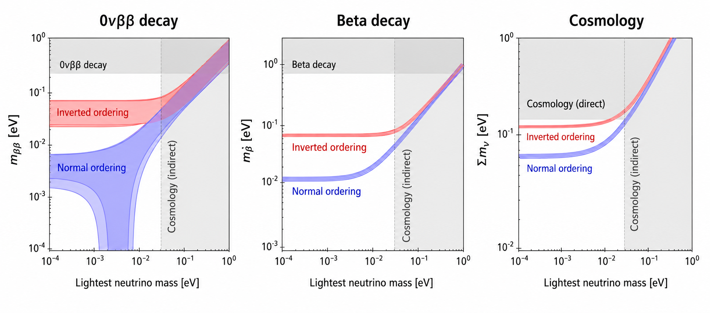
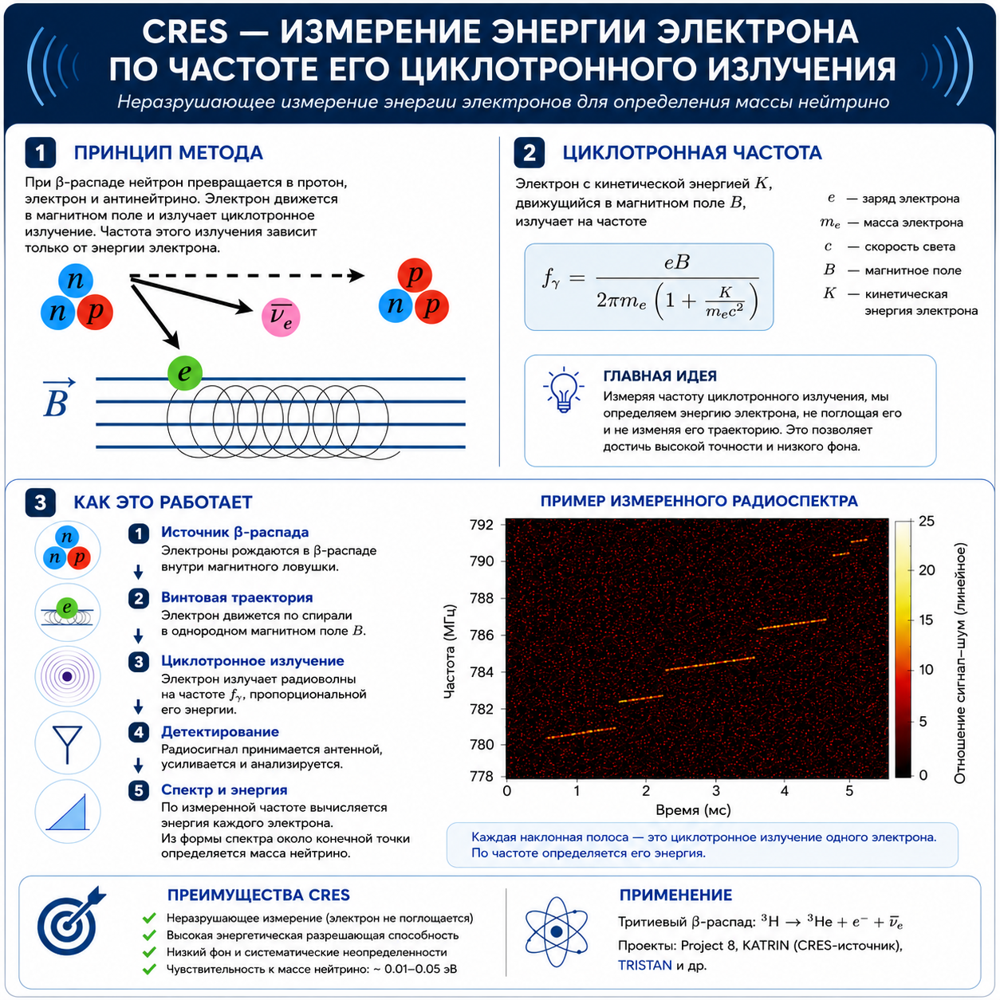
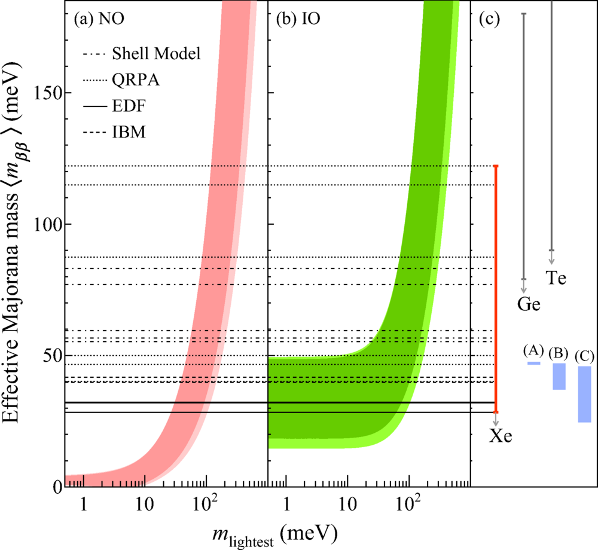
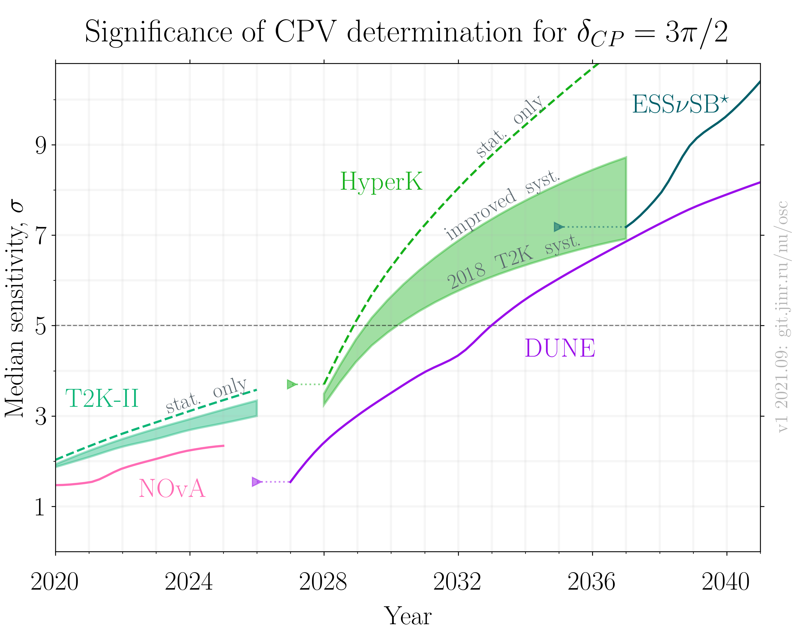
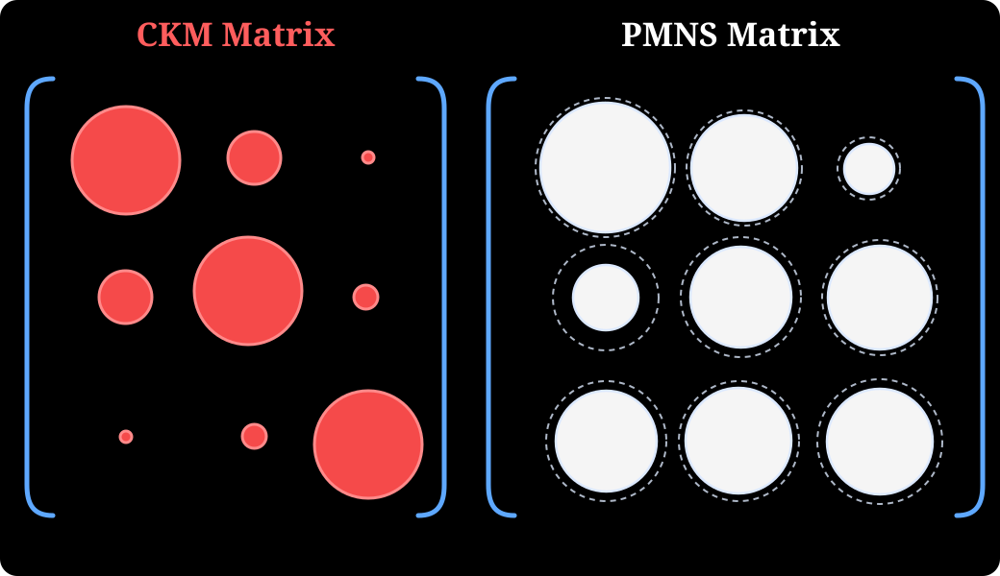
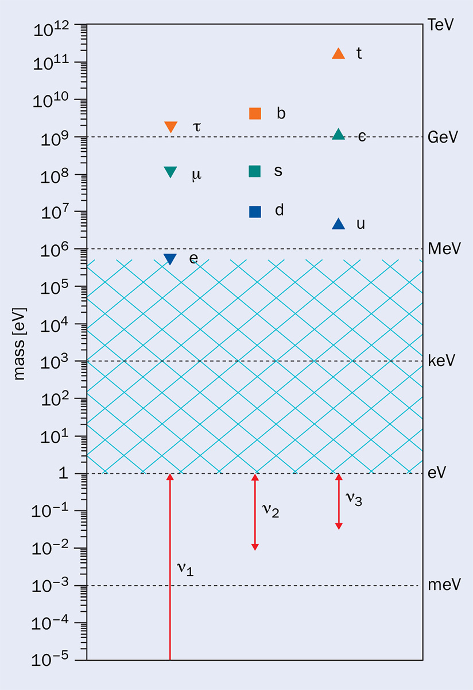
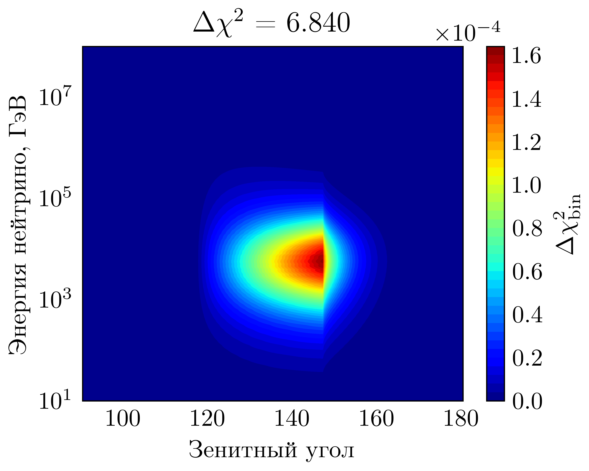
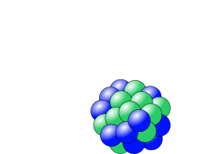
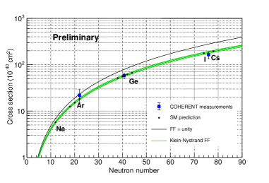
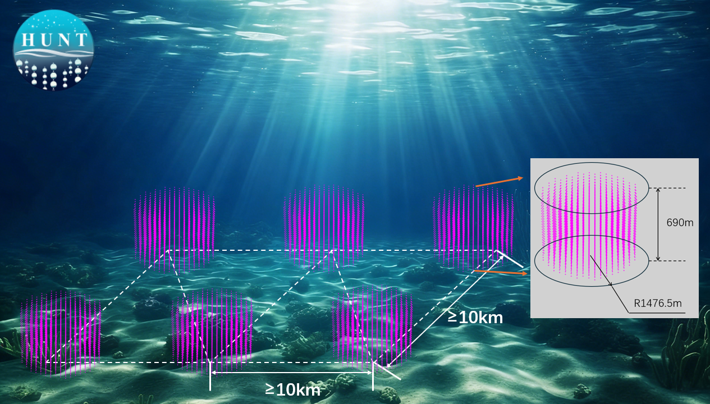

# Что мы знаем о нейтрино

## Нейтрино в Стандартной модели

::: {.incremental}
- Нейтрино — фермион со спином $1/2$.
- Электрический заряд:
  - Теоретически равен нулю. 
  - Экспериментально ограничен:
    - нейтральностью материи: $|q_\nu| < 10^{-21}e$.
    - на АЭС: $|q_\nu| < 10^{-12}e$.
- Нейтрино участвуют в слабом взаимодействии с обменом $W^\pm$, $Z$.
- Открыты три лептонных флэйвора (аромата):
$$
\begin{pmatrix}
\nu_e\\
e
\end{pmatrix}, \quad \begin{pmatrix}
\nu_\mu\\
\mu
\end{pmatrix}, \quad \begin{pmatrix}
\nu_\tau\\
\tau
\end{pmatrix}.
$$
  - Измерение ширины $\Gamma(Z^0\to\text{all})$ даёт $N_\nu = 2.984\pm 0.008$.
- У нейтрино есть масса, но флэйворные состояния не совпадают с массовыми:
$$
|\nu_\alpha\rangle = \sum_i V^*_{\alpha i}|\nu_i\rangle.
$$

:::

## Смешивание лептонов 

Смешивание описывается матрицей Понтекорво-Маки-Накагавы-Саки (PMNS):

$$
V
=
\begin{pmatrix}
V_{e1} & V_{e2} & V_{e3} \\
V_{\mu1} & V_{\mu2} & V_{\mu3} \\
V_{\tau1} & V_{\tau2} & V_{\tau3}
\end{pmatrix}
=
\begin{pmatrix}
1 & 0 & 0 \\
0 & c_{23} & s_{23} \\
0 & -s_{23} & c_{23}
\end{pmatrix}
\begin{pmatrix}
c_{13} & 0 & s_{13} e^{-i\delta} \\
0 & 1 & 0 \\
-s_{13} e^{i\delta} & 0 & c_{13}
\end{pmatrix}
\begin{pmatrix}
c_{12} & s_{12} & 0 \\
-s_{12} & c_{12} & 0 \\
0 & 0 & 1
\end{pmatrix}
\begin{pmatrix}
e^{i\alpha_1/2} & 0 & 0 \\
0 & e^{i\alpha_2/2} & 0 \\
0 & 0 & 1
\end{pmatrix} .
$$

где $s_{ij}\equiv \sin\theta_{ij}$, $c_{ij}\equiv \cos\theta_{ij}$,
$\delta$ — фаза CP-нарушения, $\alpha_{1,2}$ — майорановские фазы.

$$
V=
\begin{pmatrix}
c_{12} c_{13} & s_{12} c_{13} & s_{13} e^{-i\delta} \\
- s_{12} c_{23} - c_{12} s_{23} s_{13} e^{i\delta}
&
c_{12} c_{23} - s_{12} s_{23} s_{13} e^{i\delta}
&
s_{23} c_{13}
\\
s_{12} s_{23} - c_{12} c_{23} s_{13} e^{i\delta}
&
- c_{12} s_{23} - s_{12} c_{23} s_{13} e^{i\delta}
&
c_{23} c_{13}
\end{pmatrix}
\begin{pmatrix}
e^{i\alpha_1/2} & 0 & 0 \\
0 & e^{i\alpha_2/2} & 0 \\
0 & 0 & 1
\end{pmatrix}.
$$

## Осцилляции нейтрино

::: {.incremental}
- Смешивание во взаимодействиях поколений лептонов с $W^\pm$ бозонами и ненулевые и отличающиеся массы нейтрино приводят к явлению осцилляций нейтрино.
- Вероятности осцилляций зависят от
$$
\Delta m^2_{ij}\quad \theta_{ij}\quad \delta.
$$
и от расстояния и энергии нейтрино.
- Так определяются:
$$
\theta_{12} \approx 34^\circ, \quad \theta_{13} \approx 9^\circ, \quad\theta_{23} \approx 45^\circ.
$$
$$
\Delta m^2_{21}\approx 7.4\times 10^{-5}\ \mathrm{eV}^2, \quad |\Delta m^2_{31}|\approx 2.5\times 10^{-3}\ \mathrm{eV}^2
$$ 

:::

## Масса нейтрино

::: {.incremental}
- Ограничения снизу:
$$
\begin{aligned}
|\Delta m^2_{31}|\approx 2.5\times 10^{-3}\ \mathrm{eV}^2 \quad &\hookrightarrow\quad 
m_{3(1)}\ge \sqrt{|\Delta m^2_{31}|} \approx 50\ \mathrm{meV},\quad \text{NO(IO)},\\
\Delta m^2_{21}\approx 7.4\times 10^{-5}\ \mathrm{eV}^2 \quad &\hookrightarrow\quad 
m_{2}\ge \sqrt{\Delta m^2_{21}} \approx 8\ \mathrm{meV}.
\end{aligned}
$$
- Ограничения сверху:
$$
\begin{aligned}
\sum_i m_i < 120 \ \mathrm{meV} & \quad \text{(космология)},\\
m_\beta < 45\ \mathrm{meV} & \quad {}^3\mathrm{H}\to {}^3\mathrm{He}+e^-+\bar{\nu}_e, \quad m_\beta^2 = \sum_i |V_{ei}|^2 m_i^2.
\end{aligned}
$$  

:::
# Неизвестно: упорядоченность масс

## Упорядоченность масс

:::: {.columns}

::: {.column width="50%" .incremental}
- Нормальный порядок (NO): 
$$
m_1 < m_2 < m_3.
$$
- Обратный порядок (IO): 
$$
m_3 < m_1 < m_2.
$$
- Упорядоченность масс влияет на интерпретацию $0\nu\beta\beta$.
- Важна для сверхновых, космологии и определения массы самого легкого нейтрино.
- JUNO, DUNE, NOvA, T2K, Hyper-K, ORCA, IceCube Upgrade и другие эксперименты дадут ответ на этот вопрос в течении десятилетия.
:::

::: {.column width="50%"}

```{=html}
<video data-autoplay loop muted playsinline style="width: 100%;">
  <source src="media/NeutrinoHierarchyScales.mp4" type="video/mp4">
</video>
```

:::

::::


#  Неизвестно: масса самого легкого нейтрино
## Масса самого легкого нейтрино

::: {.incremental}
- Ограничения снизу:
$$
\begin{aligned}
|\Delta m^2_{31}|\approx 2.5\times 10^{-3}\ \mathrm{eV}^2 \quad &\hookrightarrow\quad 
m_{3(1)}\ge \sqrt{|\Delta m^2_{31}|} \approx 50\ \mathrm{meV},\quad \text{NO(IO)},\\
\Delta m^2_{21}\approx 7.4\times 10^{-5}\ \mathrm{eV}^2 \quad &\hookrightarrow\quad 
m_{2}\ge \sqrt{\Delta m^2_{21}} \approx 8\ \mathrm{meV}.
\end{aligned}
$$

- Нет ограничения снизу (кроме нуля) на $m_{\,\mathrm{lightest}}$.
{width="80%" .slide-image-center}

:::

# Масса самого легкого нейтрино: что дальше?

:::: {.columns}

::: {.column width="45%" .incremental}

- KATRIN:
  - Обработать данные до 2025 года. Чувствительность: $m_\beta < 0.3\ \mathrm{eV}$ (90\% CL).
  - 2026-2027: TRISTAN@KATRIN, поиск стерильного нейтрино.
  - 2028-2034: R&D для следующего поколения, чувствительность $m_\beta < 0.045\ \mathrm{eV}$.
- Project 8 — спектроскопия циклотронного излучения электрона (CRES):
  - Чувствительность: 0.01–0.05 эВ 
:::

::: {.column width="55%" .incremental}
 
{width="70%" .slide-image-center}

:::

::::

#  Неизвестно: Дирак или Майорана?
## Дирак или Майорана?

::: {.incremental}
- Дирак: нейтрино и антинейтрино — разные частицы
- Майорана: нейтрино и антинейтрино — одна и та же частица
- Если нейтрино — майорановские частицы, возможен **безнейтринный двойной бета-распад**:
$$
(A,Z)\to (A,Z+2)+2e^-.
$$
- Этот процесс нарушает лептонное число на 2 единицы и может происходить только для майорановских нейтрино.
- $0\nu\beta\beta$ — единственный известный экспериментальный способ установить майорановскую природу нейтрино.
- KamLAND-Zen, 800:
$$
m_{\beta\beta}< 22-122 \mathrm{meV}
$$
- CUORE (Science 390, 1029-1032 (2025)):
$$
m_{\beta\beta}< 70-250 \mathrm{meV}
$$
- LEGEND-200 (Phys.Rev.Lett. 136 (2026) 2, 022701):
$$
m_{\beta\beta}< 75-200 \mathrm{meV}
$$
:::

## Дирак или Майорана?

:::: {.columns}

::: {.column width="50%"}

### Что дальше?

Эффективная майорановская масса $m_{\beta\beta}=\left|\sum_i V_{ei}^2\,m_i\right|$

- Следующее поколение экспериментов (**SNO+**, **SuperNEMO**, **AMoRE-II**) начинает набирать данные.

- В течение ближайшего десятилетия установки тонного масштаба (**LEGEND-1000**, **CUPID**, **nEXO**, **NEXT-HD** и др.) должны полностью проверить IO область.

- Важное ограничение чувствительности связано с неопределённостью ядерных матричных элементов, определяющих связь между периодом полураспада и $m_{\beta\beta}$.

- Для исследования значительной части области **нормальной иерархии** потребуются новые технологии и детекторы существенно большего масштаба.

:::

::: {.column width="50%"}

{width=100% .slide-image-center}

\small
Phys. Rev. Lett. **135** (2025) 262501

:::

::::

#  Неизвестно: CP-нарушение
## CP-нарушение

:::: {.columns}

::: {.column width="50%" .incremental}
- CP-нарушение в PMNS-матрице может быть связано с идеями лептогенезиса.
- Экспериментально CP-нарушение проявляется в различии вероятностей осцилляций нейтрино и антинейтрино:
$$
P(\nu_\alpha\to\nu_\beta)\neq P(\bar\nu_\alpha\to\bar\nu_\beta).
$$  
- Очень сложное измерение.
- Эксперименты с ускорительными и атмосферными нейтрино это главная надежда
:::

::: {.column width="50%"}

{width=100% .slide-image-center}

:::

::::

# Неизвестно: возможная новая физика
## Возможная новая физика

::: {.incremental}
- Стерильные нейтрино: мотивация из аномалий и из теории масс.
- Нестандартные взаимодействия: возможные отклонения от SM-описания рассеяния и распространения.
- Электромагнитные свойства: магнитный момент, миллизаряд, зарядовый радиус.
- Текущая ситуация:
  - область возможных параметров стерильных нейтрино сильно ограничена;
  - отклонений от СМ не найдено;
  - область остаётся важной как поиск новой физики.
:::


# Флэйворная загадка
## Флэйворная загадка

{fig-alt="Сравнение размеров элементов матриц CKM и PMNS" width="80%" .slide-image-center}

## Флэйворная загадка

{width="80%" fig-align="center"}

# Нейтрино как инструмент

## От объекта исследования к инструменту


:::: {.columns}

::: {.column width="50%" .incremental}
Нейтрино позволяют смотреть туда, где фотоны не работают напрямую.

- Солнце и звёзды: прямой зонд термоядерных реакций.
- Сверхновые: диагностика коллапса ядра.
- Земля: геонейтрино и, в перспективе, томография.
- Реакторы: мониторинг и фундаментальная физика на коротких базах.
- Далёкий космос: астрофизические нейтрино высоких энергий.
:::

::: {.column width="50%"}
{width="80%" .slide-image-center}

В.А. Аллахвердян. Диссертация 2026 (ОИЯИ) https://issc.jinr.ru/files/326/f_2_5830.pdf
:::

::::

## Реакторы и когерентное рассеяние

:::: {.columns}

::: {.column width="50%" .incremental}

- Реактор — интенсивный источник $\bar\nu_e$.

- Когерентное упругое рассеяние:
{width="40%" .slide-image-center}

- Сечение растёт примерно как $N^2$.
- Цена — малые энергии отдачи ядра.
- Это чувствительно к слабому заряду, новым взаимодействиям, магнитному моменту и фоновым моделям.
- Реакторные площадки становятся лабораториями низкоэнергетической нейтринной физики.
:::

::: {.column width="50%" .incremental}

{width="80%" .slide-image-center}
arXiv:2602.15652, “The COHERENT Experiment: 2026 Update”.
:::

::::


# Российские проекты

## КАЭС: реакторная нейтринная физика

Калининская АЭС — естественная площадка для нейтринных экспериментов на коротких расстояниях.

::: {.incremental}
- Интенсивный поток $\bar\nu_e$.
- Возможность изучать осцилляции на коротких базах.
- Поиск стерильных состояний и новых взаимодействий.
- Когерентное рассеяние и низкопороговые детекторы.
- Потенциальная прикладная линия: нейтринный мониторинг реакторов.
:::


## Baikal-GVD

Baikal-GVD — российский вклад в нейтринную астрономию высоких энергий (2026: $0.8$ км$^3$).

::: {.incremental}
- Регистрация астрофизических нейтрино в естественной водной среде.
- Измерение диффузного потока.
- Поиск точечных источников.
- Галактическая плоскость, активные галактики, мульти-мессенджерные совпадения.
- Первые результаты:
  - Астрофизические нейтрино сверхвысоких энергий:
    - 2013: Открыты в IceCube
    - 2023: Подтверждены Baikal-GVD
  - Два нейтрино от одного источника TXS 0506+056: 
    - 2017: IceCube: 290 TeV
    - 2021: Baikal-GVD: 224 TeV
  - Млечный Путь как источник:
    - Указание от Baikal-GVD @2.5σ
    - Совместный анализ Baikal-GVD + IceCube повышает значимость до 3.6σ. 
:::


## Baikal-HUNT

Следующий шаг — детектор объемом (10-30) км$^3$ на озере Байкал.

::: {.incremental}
- От регистрации редких событий к открытиям на уровне 5σ.
- Совместный проект РФ и КНР.
- Крупнейшая установка в мире, которая определит развитие области в мире на десятилетия.
{.slide-image-center width="60%"}

:::

# Образовательная онлайн программа "Физика нейтрино и астрофизика частиц"

## Образовательная онлайн программа "Физика нейтрино и астрофизика частиц"

- 2 года
- Онлайн-лекции от ведущих российских экспертов.
- Два трека: теоретик и экспериментатор.
- Стипендия 45 тыс рублей со второго семестра. Можно два трека сразу.
- Исследовательский проект в конце программы.
- Цель: подготовить новое поколение исследователей нейтрино и астрофизики частиц в России.
- Подать заявку: https://teach-in.ru/program

# Итого

## Итоговая картина

::: {.incremental}
- Нейтрино имеют массу и смешиваются: это установленный факт.
- Осцилляционная картина стала количественной и точной.
- Но не решены важные вопросы:
  - масса легкого нейтрино;
  - упорядоченность масс;
  - CP-нарушение;
  - Dirac или Majorana;
  - возможная новая физика.
- Нейтрино уже стало инструментом для астрофизики, геофизики и реакторной физики.
- Российские проекты входят в эту программу через Baikal-GVD, Baikal-HUNT, реакторные эксперименты на КАЭС, эксперименты в Баксанской подземной лаборатории, Neutrino-4 и др.
- Кроме идей и установок нам нужно готовить КАДРЫ!
:::

